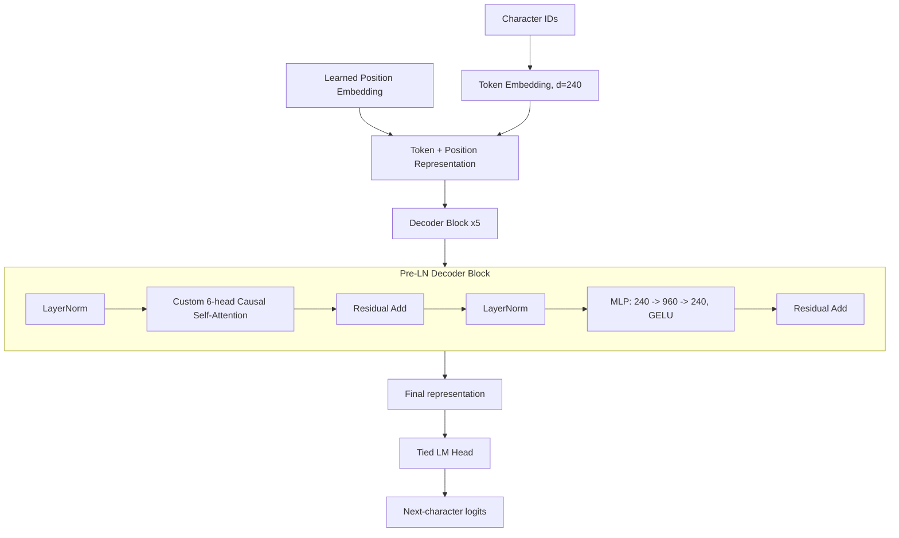
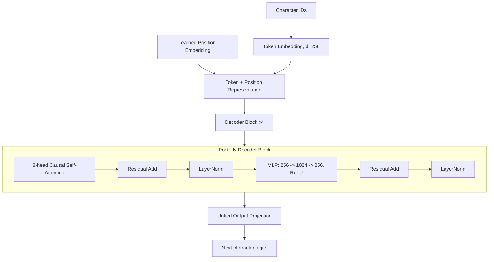
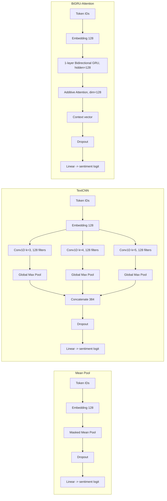
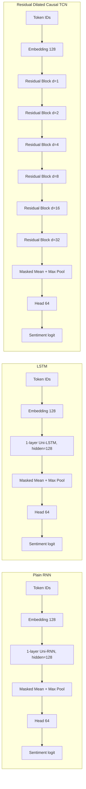
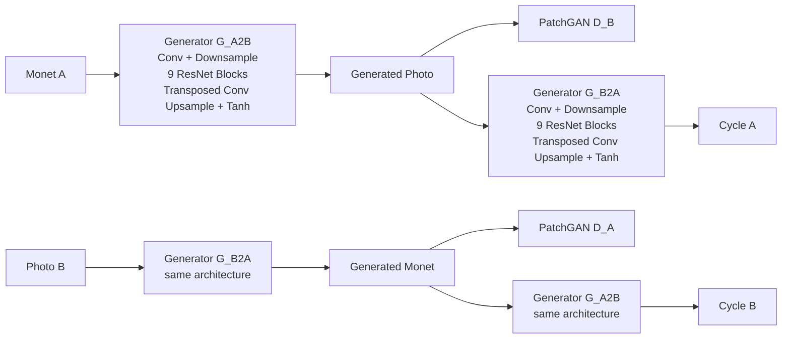
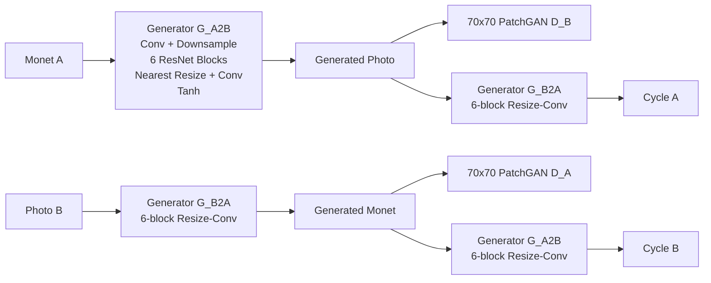

# DATA 266 Lab 1 - Team 15

This repository contains the Team 15 implementation and evaluation for DATA 266 Lab 1:

1. **Task 1:** GPT-style character language modeling from scratch on TinyStories.
2. **Task 2:** Yelp Polarity sentiment classification using neural models trained from scratch.
3. **Task 3:** unpaired Monet/photo image translation using CycleGAN.

## Team

- **Anshika Goel**
- **Viraat Chaudhary**

Each member trained and evaluated their own model configuration. This README is organized by task so that architecture, comparison, conclusions, evidence, reproducibility instructions, and smoke tests remain together.

---

# Repository structure

The tree below summarizes the current high-level repository layout. It focuses on task/member organization, canonical implementation locations, task-level documentation, and reproducibility evidence rather than enumerating every generated metric, plot, manifest, or preserved log file.

```text
data266-lab1-team15/
|
|-- README.md
|-- .gitignore
|-- .gitattributes
|-- docs/
|   `-- DATA266_Lab1_Fall_2026.pdf
|
|-- task1_llm/
|   |-- README.md
|   |-- .gitattributes
|   |-- data/
|   |-- Anshika_Goel/
|   |   |-- code/
|   |   |-- configs/
|   |   |-- checkpoints/
|   |   |-- logs/
|   |   |-- outputs/
|   |   |-- environment_manifest.txt
|   |   |-- requirements.txt
|   |   |-- results.md
|   |   `-- failure_analysis.md
|   |
|   |-- Viraat_Chaudhary/
|   |   |-- code/
|   |   |-- configs/
|   |   |-- checkpoints/
|   |   |-- logs/
|   |   |-- outputs/
|   |   |-- analysis/
|   |   |-- requirements.txt
|   |   |-- results.md
|   |   `-- failure_analysis.md
|   |
|   |-- comparison/
|   |-- reproducibility/
|   |   |-- Anshika_Goel/
|   |   `-- Viraat_Chaudhary/
|   |-- compare_task1.py
|   `-- evaluate_common.py
|
|-- task2_sentiment/
|   |-- README.md
|   |-- data/
|   |-- Anshika_Goel/
|   |   |-- configs/
|   |   |-- checkpoints/
|   |   |-- logs/
|   |   |-- notebooks/
|   |   |-- outputs/
|   |   |-- requirements.txt
|   |   |-- results.md
|   |   `-- failure_analysis.md
|   |
|   |-- Viraat_Chaudhary/
|   |   |-- configs/
|   |   |-- checkpoints/
|   |   |-- environments/
|   |   |-- inputs/
|   |   |-- logs/
|   |   |-- notebooks/
|   |   |-- outputs/
|   |   |-- provenance/
|   |   |-- references/
|   |   |-- src/
|   |   |-- requirements.txt
|   |   |-- results.md
|   |   `-- failure_analysis.md
|   |
|   `-- reproducibility/
|       |-- Anshika_Goel/
|       `-- Viraat_Chaudhary/
|
|-- task3_gan/
|   |-- README.md
|   |-- data/
|   |   |-- monet_jpg/        # local raw data / not committed
|   |   `-- photo_jpg/        # local raw data / not committed
|   |
|   |-- Anshika_Goel/
|   |   |-- code/
|   |   |-- configs/
|   |   |-- checkpoints/
|   |   |-- logs/
|   |   |-- notebooks/
|   |   |-- outputs/
|   |   |-- results.md
|   |   `-- failure_analysis.md
|   |
|   |-- Viraat_Chaudhary/
|   |   |-- configs/
|   |   |-- checkpoints/
|   |   |-- logs/
|   |   |-- outputs/
|   |   |-- src/
|   |   |-- results.md
|   |   |-- failure_analysis.md
|   |   `-- team_comparison.md
|   |
|   `-- reproducibility/
|       |-- Anshika_Goel/
|       `-- Viraat_Chaudhary/
|
|-- Part3_Evaluation_Script.ipynb
`-- submission.csv
```

Large datasets, caches, virtual environments, generated runtime workspaces, and selected large checkpoint files are intentionally excluded where documented. Reproducibility evidence is organized inside each task under `task1_llm/reproducibility/`, `task2_sentiment/reproducibility/`, and `task3_gan/reproducibility/`; canonical implementations and experiment outputs remain in the corresponding member directories.

---

# Clone the repository

From PowerShell:

```powershell
git clone https://github.com/99GoelAnshika/data266-lab1-team15.git
Set-Location data266-lab1-team15
```

Because dependency sets differ between tasks and members, use the requirement file documented in the corresponding reproduction section rather than assuming one global environment reproduces every historical run.

---

# Task 1 - GPT-style language modeling from scratch

## Goal and data protocol

Task 1 trains decoder-only character language models from scratch on TinyStories.

For Anshika's frozen run:

- Dataset: `roneneldan/TinyStories`
- Dataset revision: `f54c09fd23315a6f9c86f9dc80f725de7d8f9c64`
- Training sequences: 100,000
- Validation sequences: 10,000
- Character vocabulary: 101
- Context length: 256 characters
- Train/validation story groups are disjoint
- No pretrained language model or pretrained Transformer is used

Both members implement GPT-style autoregressive causal language models, but their Transformer configurations are materially different.

---

## Task 1 - Anshika model

### Architecture

Anshika uses a **5-block pre-layer-normalized character GPT** implemented from scratch.

| Component | Configuration |
|---|---|
| Tokenization | Character level |
| Vocabulary | 101 |
| Context length | 256 |
| Model dimension | 240 |
| Decoder blocks | 5 |
| Attention heads | 6 |
| Head dimension | 40 |
| Feed-forward dimension | 960 |
| FFN activation | GELU |
| Normalization | Pre-LayerNorm |
| Positional representation | Learned positional embeddings |
| Dropout | 0.10 |
| Output projection | Tied to token embedding |
| Trainable parameters | 3,557,861 |

The implementation uses custom causal multi-head self-attention rather than `nn.MultiheadAttention`, a prebuilt Transformer block, or a pretrained language model.

### Architecture diagram



### Recorded performance

| Metric | Value |
|---|---:|
| Validation cross-entropy | 0.693730 |
| Validation perplexity | 2.001166 |
| Bits per character | 1.000841 |
| Validation top-1 accuracy | 78.03% |
| Distinct-1 | 0.004370 |
| Distinct-2 | 0.039709 |
| Distinct-3 | 0.158188 |
| Repeated 4-gram rate | 0.222371 |
| Mean gradient norm | 0.767176 |
| Nonfinite losses | 0 |
| Trainable parameters | 3,557,861 |
| Training time | 55.09 min |

Evidence:

- [`task1_llm/Anshika_Goel/results.md`](task1_llm/Anshika_Goel/results.md)
- [`task1_llm/Anshika_Goel/failure_analysis.md`](task1_llm/Anshika_Goel/failure_analysis.md)
- [`task1_llm/Anshika_Goel/outputs/metrics/evaluation_metrics.json`](task1_llm/Anshika_Goel/outputs/metrics/evaluation_metrics.json)
- [`task1_llm/Anshika_Goel/outputs/metrics/training_summary.json`](task1_llm/Anshika_Goel/outputs/metrics/training_summary.json)

### Reproduce Anshika Task 1

Install:

```powershell
python -m pip install -r task1_llm\Anshika_Goel\requirements.txt
```

Preprocess TinyStories:

```powershell
python task1_llm\Anshika_Goel\code\data.py --config task1_llm\Anshika_Goel\configs\gpt_char.yaml
```

#### Small implementation smoke test

The committed synthetic test suite does not require the TinyStories download or a trained checkpoint:

```powershell
python -c "import sys,pytest; sys.path.insert(0,r'task1_llm\Anshika_Goel\code'); raise SystemExit(pytest.main([r'task1_llm\Anshika_Goel\code\tests','-q']))"
```

Verified result: `22 passed`.

After preprocessing, a short training-path smoke test is also available:

```powershell
python task1_llm\Anshika_Goel\code\train.py --config task1_llm\Anshika_Goel\configs\gpt_char.yaml --smoke-test
```

Full training:

```powershell
python task1_llm\Anshika_Goel\code\train.py --config task1_llm\Anshika_Goel\configs\gpt_char.yaml
```

Evaluation and generation:

```powershell
python task1_llm\Anshika_Goel\code\evaluate_generate.py --config task1_llm\Anshika_Goel\configs\gpt_char.yaml --checkpoint task1_llm\Anshika_Goel\checkpoints\best_model.pt
```

---

## Task 1 - Viraat model

### Architecture

Viraat uses a separate **4-block post-layer-normalized decoder**.

| Component | Configuration |
|---|---|
| Tokenization | Character level |
| Model dimension | 256 |
| Decoder blocks | 4 |
| Attention heads | 8 |
| Feed-forward dimension | 1024 |
| FFN activation | ReLU |
| Normalization | Post-LayerNorm |
| Dropout | 0.15 |
| Output projection | Untied |
| Trainable parameters | 3,273,824 |

### Architecture diagram



### Reproduce Viraat Task 1

Install:

```powershell
python -m pip install -r task1_llm\Viraat_Chaudhary\requirements.txt
```

Small synthetic smoke test:

```powershell
python task1_llm\Viraat_Chaudhary\code\smoke_test.py
```

The smoke test does not require TinyStories.

Restore/verify processed data when required:

```powershell
python task1_llm\Viraat_Chaudhary\code\data.py
```

Additional instructions are in:

- [`task1_llm/Viraat_Chaudhary/README.md`](task1_llm/Viraat_Chaudhary/README.md)
- [`task1_llm/Viraat_Chaudhary/RUN_GUIDE.md`](task1_llm/Viraat_Chaudhary/RUN_GUIDE.md)

---

## Task 1 - Direct model comparison

The repository includes a common held-out evaluation so that the two frozen models are compared on the same validation text.

| Model | Blocks | d_model | Heads | Parameters | Common CE | Common top-1 accuracy |
|---|---:|---:|---:|---:|---:|---:|
| Anshika GPT | 5 | 240 | 6 | 3,557,861 | **0.69440728** | **78.1023%** |
| Viraat GPT | 4 | 256 | 8 | 3,273,824 | 0.86098925 | 72.9764% |

### Which Task 1 model is better?

Under the repository's **common held-out quality evaluation**, **Anshika's model is the stronger Task 1 checkpoint**.

It achieves:

- lower cross-entropy;
- higher next-character accuracy;
- a roughly similar parameter budget;
- stable optimization with no recorded nonfinite losses.

This does **not** mean that every architectural difference has been causally isolated. The two models differ simultaneously in depth, width, head count, normalization placement, activation function, dropout, and weight tying. The defensible conclusion is therefore that **Anshika's trained configuration performed better on the common evaluation**, not that one individual design choice alone caused the improvement.

Rebuild the team comparison:

```powershell
python task1_llm\compare_task1.py
python task1_llm\evaluate_common.py
```

Comparison evidence:

- [`task1_llm/comparison/task1_comparison.md`](task1_llm/comparison/task1_comparison.md)
- [`task1_llm/comparison/best_model_selection.md`](task1_llm/comparison/best_model_selection.md)
- [`task1_llm/comparison/common_validation_comparison.csv`](task1_llm/comparison/common_validation_comparison.csv)

---

# Task 2 - Yelp Polarity sentiment classification

## Shared task

Both members classify the binary Yelp Polarity dataset using embeddings learned from scratch.

No pretrained embedding model or pretrained language model is used.

The common task population contains:

- 560,000 official training reviews;
- 504,000 frozen training reviews after the development split;
- 56,000 validation reviews;
- 38,000 official test reviews;
- maximum sequence length of 256 tokens;
- training-only vocabulary size of 50,000.

The official test set was used only after model selection was frozen.

---

# Task 2 - Anshika models

Anshika compares three substantially different representations of text structure:

1. masked mean pooling;
2. local convolutional phrase extraction;
3. bidirectional recurrent context with learned attention.

## Architecture comparison

| Model | Core architecture | Parameters | Main inductive bias |
|---|---|---:|---|
| Mean Pool | Embedding -> masked mean -> linear | 6,400,129 | Order-independent lexical evidence |
| TextCNN | Embedding -> Conv1D 3/4/5 -> global max -> linear | 6,597,377 | Local n-gram/phrase patterns |
| BiGRU-Attention | Embedding -> bidirectional GRU -> additive attention -> linear | 6,631,425 | Ordered bidirectional context + weighted aggregation |

### Architecture diagrams



## Final official-test metrics

| Model | Accuracy | Macro-F1 | MCC | ROC-AUC | PR-AUC | Brier | ECE |
|---|---:|---:|---:|---:|---:|---:|---:|
| Mean Pool | 0.929474 | 0.929474 | 0.858947 | 0.977648 | 0.977576 | 0.053777 | 0.008339 |
| TextCNN | 0.941737 | 0.941736 | 0.883491 | 0.985671 | 0.986079 | 0.044814 | 0.017341 |
| **BiGRU-Attention** | **0.944868** | **0.944864** | **0.889869** | **0.988415** | **0.988652** | **0.040506** | **0.007061** |

### Which of Anshika's Task 2 models is better?

**BiGRU-Attention is the strongest observed Anshika model.**

It has the highest observed:

- accuracy;
- macro-F1;
- MCC;
- ROC-AUC;
- PR-AUC;

and the lowest Brier score and ECE among the three.

Both TextCNN and BiGRU-Attention significantly improve paired error behavior relative to the mean-pooling baseline under the predeclared McNemar comparisons. There was **no TextCNN-vs-BiGRU paired McNemar test**, so the README does not claim statistical significance between those two experimental models.

## Reproduce Anshika Task 2

Install:

```powershell
python -m pip install -r task2_sentiment\Anshika_Goel\requirements.txt
```

The workflow is preserved as executed notebooks:

```text
01_data_analysis_preprocessing.ipynb
02_train_baseline_mean_pool.ipynb
03_train_textcnn.ipynb
04_train_bigru_attention.ipynb
05_evaluate_compare_models.ipynb
06_manual_error_analysis.ipynb
```

Run them in order for a full reproduction.

### Small checkpoint-load smoke test

This smoke test checks that the three committed checkpoints can be opened by the installed PyTorch environment. It does not rerun training or consume the official test set.

```powershell
python -c "import torch; from pathlib import Path; files=[Path(r'task2_sentiment\Anshika_Goel\checkpoints\baseline_mean_pool_best.pt'),Path(r'task2_sentiment\Anshika_Goel\checkpoints\textcnn_best.pt'),Path(r'task2_sentiment\Anshika_Goel\checkpoints\bigru_attention_best.pt')]; [print(p.name,'OK',type(torch.load(p,map_location='cpu',weights_only=False)).__name__) for p in files]"
```

Evidence:

- [`task2_sentiment/Anshika_Goel/results.md`](task2_sentiment/Anshika_Goel/results.md)
- [`task2_sentiment/Anshika_Goel/failure_analysis.md`](task2_sentiment/Anshika_Goel/failure_analysis.md)
- [`task2_sentiment/Anshika_Goel/outputs/metrics/final_test_metrics.json`](task2_sentiment/Anshika_Goel/outputs/metrics/final_test_metrics.json)
- [`task2_sentiment/Anshika_Goel/outputs/metrics/bootstrap_confidence_intervals.json`](task2_sentiment/Anshika_Goel/outputs/metrics/bootstrap_confidence_intervals.json)

---

# Task 2 - Viraat models

Viraat evaluates:

1. a plain RNN;
2. a unidirectional LSTM;
3. a residual dilated causal TCN.

All embeddings and classifier weights were trained from scratch.

## Architecture comparison

| Model | Core architecture | Parameters | Main inductive bias |
|---|---|---:|---|
| RNN | Embedding -> unidirectional RNN -> mean/max pooling -> head | 6,450,049 | Sequential context |
| LSTM | Embedding -> unidirectional LSTM -> mean/max pooling -> head | 6,549,121 | Gated sequential memory |
| TCN | Embedding -> six residual dilated causal blocks -> mean/max pooling -> head | 7,027,969 | Multi-scale convolutional context |

Shared RNN/LSTM settings include:

- embedding dimension: 128;
- hidden dimension: 128;
- one recurrent layer;
- masked mean + masked maximum pooling;
- head dimension: 64;
- dropout: 0.25;
- embedding dropout: 0.10.

The TCN uses:

- channels: 128;
- kernel size: 3;
- six residual blocks;
- dilation sequence: `1, 2, 4, 8, 16, 32`;
- effective receptive field: approximately 253 tokens.

### Architecture diagrams



## Final official-test metrics

| Model | Accuracy | Macro-F1 | MCC | ROC-AUC | PR-AUC | Brier | ECE |
|---|---:|---:|---:|---:|---:|---:|---:|
| RNN | 0.942658 | 0.942657 | 0.885343 | 0.986512 | 0.986900 | 0.042879 | **0.002350** |
| **LSTM** | **0.948474** | **0.948472** | **0.897019** | 0.989121 | 0.989355 | **0.038735** | 0.008854 |
| TCN | 0.948026 | 0.948021 | 0.896242 | **0.989122** | **0.989492** | 0.039448 | 0.011682 |

### Which of Viraat's Task 2 models is better?

For the primary observed classification-quality/efficiency tradeoff, **the LSTM is the strongest Viraat model**.

It has:

- the highest accuracy;
- the highest macro-F1;
- the highest MCC;
- the lowest Brier score among the three;
- training time of about 57 seconds versus about 281 seconds for the TCN.

The TCN has marginally higher ROC-AUC and PR-AUC and performs particularly well on long-review slices, so it remains competitive. However, its much greater computational cost does not produce a corresponding improvement in overall accuracy or macro-F1.

No LSTM-vs-TCN paired significance test was reported, so the very small difference between them should not be interpreted as a statistically established architecture advantage.

## Reproduce Viraat Task 2

Install:

```powershell
python -m pip install -r task2_sentiment\Viraat_Chaudhary\requirements.txt
```

CPU checkpoint smoke test:

```powershell
python task2_sentiment\Viraat_Chaudhary\src\evaluator.py --smoke --config task2_sentiment\Viraat_Chaudhary\configs\baseline.json
```

The smoke test loads the selected RNN checkpoint with frozen preprocessing and performs inference on synthetic sentences. It does not download Yelp or recompute official-test accuracy.

> **Windows line-ending note:** Viraat's evaluator performs byte-exact SHA-256 verification of the frozen preprocessing and configuration files. The recorded hashes correspond to the LF bytes stored in Git. A Windows checkout using `core.autocrlf=true` can convert tracked text files to CRLF, causing the strict integrity check to fail even though `git diff` reports no content change.
>
> Do **not** edit the integrity manifests or replace the recorded hashes. Use an LF-preserving checkout for this smoke test. One Windows-safe option is:
>
>     git -c core.autocrlf=false clone https://github.com/99GoelAnshika/data266-lab1-team15.git data266-lab1-team15-lf
>     Set-Location data266-lab1-team15-lf
>     python task2_sentiment\Viraat_Chaudhary\src\evaluator.py --smoke --config task2_sentiment\Viraat_Chaudhary\configs\baseline.json
>
> The evaluator was independently verified on Windows from an LF-exact temporary copy of the tracked files; it completed successfully without changing the recorded integrity metadata.

For the complete notebook execution order, see:

- [`task2_sentiment/Viraat_Chaudhary/RUN_ORDER.md`](task2_sentiment/Viraat_Chaudhary/RUN_ORDER.md)
- [`task2_sentiment/Viraat_Chaudhary/README.md`](task2_sentiment/Viraat_Chaudhary/README.md)

---

# Task 2 - Team comparison

The following table compares all six recorded models descriptively.

| Member | Model | Accuracy | Macro-F1 | MCC |
|---|---|---:|---:|---:|
| Anshika | Mean Pool | 0.929474 | 0.929474 | 0.858947 |
| Anshika | TextCNN | 0.941737 | 0.941736 | 0.883491 |
| Anshika | BiGRU-Attention | 0.944868 | 0.944864 | 0.889869 |
| Viraat | RNN | 0.942658 | 0.942657 | 0.885343 |
| **Viraat** | **LSTM** | **0.948474** | **0.948472** | **0.897019** |
| Viraat | TCN | 0.948026 | 0.948021 | 0.896242 |

### Which Task 2 model is best overall?

Among the six **observed runs**, Viraat's LSTM has the highest accuracy, macro-F1, and MCC.

That should be interpreted as a **descriptive result**, not proof that an LSTM is intrinsically superior to BiGRU-Attention or the TCN. Cross-member preprocessing details, tokenizer-derived slices, hardware, and training conditions are not a controlled single-factor architecture experiment.

The defensible conclusions are:

- Anshika's **BiGRU-Attention** is best among Anshika's three models.
- Viraat's **LSTM** is best on the principal observed classification metrics among Viraat's three.
- Viraat's **LSTM** has the highest observed accuracy/macro-F1 in the six-model table.
- Architecture causality cannot be isolated from the cross-member comparison.

---

# Task 3 - CycleGAN Monet/photo style transfer

## Shared problem

Task 3 learns unpaired translations between:

- **Domain A:** Monet paintings;
- **Domain B:** photographs.

Expected local data locations:

```text
task3_gan/data/monet_jpg/
task3_gan/data/photo_jpg/
```

The image files are intentionally not committed to Git.

Both members train CycleGANs from scratch using:

- two generators;
- two PatchGAN discriminators;
- least-squares GAN loss;
- cycle-consistency loss;
- identity loss;
- unpaired sampling;
- direct image generation in both directions.

No pretrained or foundation image generator produces the submitted translations.

---

# Task 3 - Anshika model

## Architecture

Anshika's final selected model is the epoch-125 checkpoint from:

```text
cyclegan_baseline_rtx4090_run001
```

The model contains:

- two ResNet generators;
- **9 residual blocks per generator**;
- 64 base channels;
- instance normalization;
- two PatchGAN discriminators;
- least-squares adversarial loss;
- cycle-consistency L1 loss;
- identity L1 loss;
- Adam optimization.

Total trainable parameters across the four networks:

**28,285,832**

### Why this architecture?

The architecture is well matched to **unpaired 256x256 style translation**:

- **ResNet generators** preserve a strong spatial/content path while residual blocks learn the appearance transformation between photographs and Monet-style imagery.
- **Nine residual blocks** provide substantial transformation capacity for 256x256 images. In this experiment, the selected nine-block configuration ultimately produced the stronger official average FID/MiFID and cycle-reconstruction metrics relative to the smaller teammate configuration, although the comparison is not a single-variable ablation.
- **Instance normalization** normalizes per-image feature statistics and is appropriate for an image-style-transfer setting where appearance statistics change between domains.
- **PatchGAN discriminators** judge local image patches rather than only a single whole-image score, encouraging realistic local texture and style.
- **Cycle-consistency loss** is essential because the Monet and photograph datasets are unpaired: translating to the opposite domain and back constrains the generators to preserve source content.
- **Identity loss** discourages unnecessary changes when an image is already presented to the generator corresponding to its own domain.
- **Least-squares GAN loss** supplies the adversarial objective used by the recorded implementation.

These design choices explain why the architecture is suitable for this task, but the recorded experiments do not isolate the causal contribution of any single component.

### Architecture diagram



## Final performance

The selected epoch-125 model completed:

- 125 epochs;
- global step 879,750;
- approximately 27.87 recorded training hours;
- zero logged nonfinite gradient events.

### Automatic evaluation

| Metric | Monet -> Photo | Photo -> Monet | Mean / official |
|---|---:|---:|---:|
| FID | 96.068450 | 98.864013 | **97.466148 official** |
| MiFID | 0.413548 | 0.400183 | **0.406866 official** |
| KID | 0.017190 | 0.007900 | 0.012545 |
| Generative precision | 0.780000 | 0.433333 | 0.606667 |
| Generative recall | 0.333333 | 0.630000 | 0.481667 |
| Cycle L1 | 0.032256 | 0.034622 | **0.033439** |
| Cycle LPIPS | 0.182873 | 0.134368 | **0.158620** |
| Content cosine | 0.783451 | 0.754759 | **0.769105** |

The official instructor evaluator produces:

```text
FID   = 97.46614849815103
MiFID = 0.40686556964620363
```

Time-dependent Kaggle placement is intentionally omitted from this README.

Evidence:

- [`task3_gan/Anshika_Goel/results.md`](task3_gan/Anshika_Goel/results.md)
- [`task3_gan/Anshika_Goel/failure_analysis.md`](task3_gan/Anshika_Goel/failure_analysis.md)
- [`task3_gan/Anshika_Goel/full_metrics_report.csv`](task3_gan/Anshika_Goel/full_metrics_report.csv)
- [`task3_gan/Anshika_Goel/outputs/evaluation/`](task3_gan/Anshika_Goel/outputs/evaluation/)
- [`submission.csv`](submission.csv)

## Reproduce / smoke-test Anshika Task 3

Install production dependencies:

```powershell
python -m pip install -r task3_gan\Anshika_Goel\configs\requirements_task3.txt
```

The final large epoch-125 checkpoint is preserved outside normal Git blob storage; its SHA-256 and checkpoint manifests remain committed. The canonical configuration is:

```text
task3_gan/Anshika_Goel/configs/cyclegan_baseline.json
```

### Small architecture smoke test

This test constructs the real 9-block architecture and performs a random forward pass. It does not require the dataset, does not train, and does not write experiment artifacts.

```powershell
python -c "import sys,torch; sys.path.insert(0,r'task3_gan\Anshika_Goel\code'); from models import build_cyclegan_models,count_trainable_parameters; m=build_cyclegan_models(); x=torch.randn(1,3,256,256); y=m['generator_a_to_b'](x); d=m['discriminator_b'](y); print('generator_output=',tuple(y.shape)); print('patch_output=',tuple(d.shape)); print('trainable_parameters=',sum(count_trainable_parameters(v) for v in m.values()))"
```

A full new training run uses the canonical training launcher in `task3_gan/Anshika_Goel/code/train.py` after the two raw image domains are restored locally.

---

# Task 3 - Viraat model

## Relationship to Anshika's implementation

Viraat's Task 3 work **adapts the team's existing CycleGAN training infrastructure rather than starting from a completely unrelated codebase**.

The recorded provenance identifies Anshika's implementation as the source. Several training-support modules were reused unchanged, while Viraat modified the model, trainer, data, and training entry-point code.

Most importantly, Viraat's **trained architecture is not identical to Anshika's**.

He changes the generator from the 9-block team baseline to a **6-residual-block resize-convolution generator** and trains a separate configuration from scratch.

Therefore the appropriate description is:

> Viraat reused and adapted the shared CycleGAN infrastructure, but trained a materially modified CycleGAN configuration with a smaller generator and a different upsampling strategy.

## Architecture

Viraat's final run:

```text
viraat_resizeconv6_run001
```

uses:

- two RGB ResNet generators;
- **6 residual blocks per generator**;
- 64 base channels;
- instance normalization;
- nearest-neighbor resize followed by reflection-padded convolution for upsampling;
- tanh output;
- two 3-layer 70x70 PatchGAN discriminators;
- least-squares GAN loss;
- cycle L1 weight 10;
- identity effective weight 2.5;
- replay pool size 50;
- batch size 2;
- BF16 autocast with FP32 model/Adam states.

Total trainable parameters:

**21,204,872**

### Architecture diagram



## Viraat final performance

The run completed:

- 60 epochs;
- 211,140 optimizer-loop steps;
- 5.2667 recorded training hours;
- 44.544 domain images/second;
- 2,587.737 MiB peak allocated CUDA memory;
- zero logged nonfinite gradient events.

| Metric | Monet -> Photo | Photo -> Monet |
|---|---:|---:|
| FID | 103.036489 | **95.615238** |
| MiFID | 0.416142 | 0.405585 |
| KID | 0.024615 | **0.007861** |
| Generative precision | 0.623333 | 0.546667 |
| Generative recall | 0.426667 | 0.596667 |
| Cycle L1 | 0.043438 | 0.046902 |
| Cycle LPIPS | 0.420099 | 0.309908 |
| Content cosine | 0.789136 | 0.793367 |

Official evaluator averages:

```text
FID   = 99.32852540409687
MiFID = 0.410869756014433
```

Time-dependent Kaggle placement is intentionally omitted.

Evidence:

- [`task3_gan/Viraat_Chaudhary/results.md`](task3_gan/Viraat_Chaudhary/results.md)
- [`task3_gan/Viraat_Chaudhary/failure_analysis.md`](task3_gan/Viraat_Chaudhary/failure_analysis.md)
- [`task3_gan/Viraat_Chaudhary/team_comparison.md`](task3_gan/Viraat_Chaudhary/team_comparison.md)
- [`task3_gan/Viraat_Chaudhary/full_metrics_report.csv`](task3_gan/Viraat_Chaudhary/full_metrics_report.csv)

## Reproduce / smoke-test Viraat Task 3

After cloning, retrieve Git LFS objects when required:

```powershell
git lfs pull
```

Install:

```powershell
python -m pip install -r task3_gan\Viraat_Chaudhary\configs\requirements_task3.txt
```

Verify retained files and hashes:

```powershell
python task3_gan\Viraat_Chaudhary\src\verify_saved_files.py
```

Run the CPU synthetic smoke test:

```powershell
python task3_gan\Viraat_Chaudhary\src\smoke_check.py
```

The smoke test uses temporary synthetic data and reduced channels to exercise:

- model construction;
- optimizer steps;
- checkpoint writing/loading;
- resume behavior;
- finite losses and gradients.

To reconstruct the instructor evaluator workspace without duplicating tracked image data:

```powershell
python task3_gan\Viraat_Chaudhary\src\prepare_evaluator_workspace.py
```

---

# Task 3 - Architecture and metric comparison

## Architecture comparison

| Property | Anshika | Viraat |
|---|---|---|
| Framework | CycleGAN | CycleGAN adapted from shared infrastructure |
| Generator family | ResNet | ResNet |
| Residual blocks | **9** | **6** |
| Base channels | 64 | 64 |
| Upsampling | **Transposed convolution** | **Nearest resize + convolution** |
| Normalization | InstanceNorm | InstanceNorm |
| Discriminator | PatchGAN | 70x70 PatchGAN |
| Cycle weight | 10 | 10 |
| Identity effective weight | 5 | 2.5 |
| Training epochs | 125 | 60 |
| Parameters | 28,285,832 | **21,204,872** |
| Recorded training time | 27.868 h | **5.267 h** |
| Recorded throughput | 17.538 domain images/s | **44.544 domain images/s** |

These are different trained configurations, not a controlled single-variable ablation. Block count, upsampling, identity weighting, batch/precision settings, and training schedule differ together.

### Human-evaluation provenance

The quantitative Task 3 comparison above is based on the recorded automatic metrics and instructor-evaluator results. No independent external-human score is used as a final-model metric in this root comparison.

For **Anshika**, the repository retains an earlier 30-sample evaluator-approved simulated/AI-assisted audit for provenance. Those simulated ratings were created before the final epoch-125 checkpoint selection and are therefore historical audit evidence, not newly collected human ratings of the final model. External human raters were not used for those scores.

For **Viraat**, the repository contains a prepared human-audit package with blinded audit images, instructions, a private manifest, and rater score-sheet artifacts. This root README does not report a completed independent-human mean or agreement statistic from that package.

Accordingly, the model comparison should be interpreted from the reproducible automatic metrics and documented qualitative/failure analysis rather than as a comparison supported by external-human preference scores.

## Performance comparison

| Metric | Anshika epoch 125 | Viraat epoch 60 | Better observed value |
|---|---:|---:|---|
| Official average FID | **97.466148** | 99.328525 | Anshika |
| Official average MiFID | **0.406866** | 0.410870 | Anshika |
| Monet -> Photo FID | **96.068450** | 103.036489 | Anshika |
| Photo -> Monet FID | 98.864013 | **95.615238** | Viraat |
| Monet -> Photo KID | **0.017190** | 0.024615 | Anshika |
| Photo -> Monet KID | 0.007900 | **0.007861** | Nearly tied / Viraat |
| Mean cycle L1 | **0.033439** | 0.045170 | Anshika |
| Mean cycle LPIPS | **0.158620** | 0.365004 | Anshika |
| Mean content cosine | 0.769105 | **0.791252** | Viraat |
| Parameters | 28.286 M | **21.205 M** | Viraat efficiency |
| Training throughput | 17.538 | **44.544** | Viraat efficiency |

## Which Task 3 model is better?

If the primary goal is the course's **official image-quality evaluator plus cycle reconstruction quality**, **Anshika's epoch-125 model is the stronger final configuration**.

It has:

- lower official average FID;
- lower official average MiFID;
- much lower cycle-reconstruction L1;
- much lower LPIPS cycle distance;
- better Monet-to-photo FID and KID.

Viraat's architecture nevertheless has important advantages:

- approximately 25% fewer trainable parameters;
- substantially higher recorded throughput;
- much shorter total training time;
- better photo-to-Monet FID;
- slightly better photo-to-Monet KID;
- higher input/translation content cosine similarity.

Therefore Viraat's six-block resize-convolution model is best interpreted as an **efficiency-focused architectural adaptation with mixed quality tradeoffs**, while Anshika's nine-block epoch-125 model remains the stronger observed choice when prioritizing the official evaluator and cycle reconstruction.

Because the runs differ in several design and training variables simultaneously, these results do not establish that residual-block count or resize-convolution alone caused the differences.

---

# Reproducibility principles

Across all tasks:

- raw logs are preserved rather than rewritten;
- configs and checkpoint identities are retained with results;
- official test outputs are evaluation evidence and are not used for post-hoc retuning;
- member-specific environments and hardware are documented where available;
- large raw datasets and caches are not committed;
- all cross-member conclusions are limited to what the recorded experiments support.

Reproducibility evidence is organized by task under `task1_llm/reproducibility/`, `task2_sentiment/reproducibility/`, and `task3_gan/reproducibility/`. Each task directory contains member-scoped instructions and selected environment, configuration, provenance, log, and checkpoint-identity evidence; canonical implementations, notebooks, outputs, and checkpoint locations remain in the corresponding member directories.

---

# Key result summary

| Task | Strongest observed configuration under the documented primary comparison |
|---|---|
| Task 1 | **Anshika 5-block pre-LN GPT** - lower common CE and higher common next-character accuracy |
| Task 2 - Anshika | **BiGRU-Attention** |
| Task 2 - Viraat | **LSTM** |
| Task 2 - six-model table | **Viraat LSTM** has highest observed accuracy/macro-F1, with cross-member comparison caveats |
| Task 3 | **Anshika epoch-125 9-block CycleGAN** for official FID/MiFID and reconstruction; Viraat is substantially more efficient |

---

# References

- Vaswani, A. et al. (2017). *Attention Is All You Need.*
- Eldan, R. and Li, Y. (2023). *TinyStories: How Small Can Language Models Be and Still Speak Coherent English?*
- Yelp Polarity dataset: `fancyzhx/yelp_polarity`.
- Zhu, J.-Y., Park, T., Isola, P., and Efros, A. A. (2017). *Unpaired Image-to-Image Translation using Cycle-Consistent Adversarial Networks.*

For detailed numerical evidence, use each member's `results.md`, `failure_analysis.md`, metric files, logs, manifests, and comparison artifacts rather than treating this root README as a replacement for the underlying evidence.