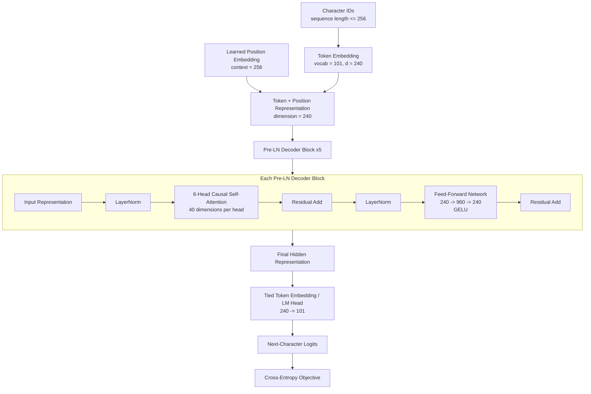
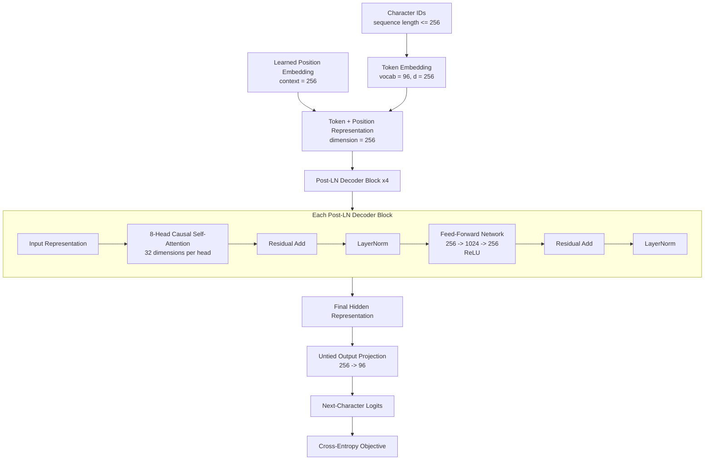

# Task 1 - GPT-Style Character Language Models From Scratch

## Overview

Task 1 builds and evaluates small GPT-style autoregressive language models **from scratch** using the `roneneldan/TinyStories` dataset.

Both Team 15 implementations operate at the **character level**. Given a sequence of characters, each model learns to predict the next character at every position using causal self-attention.

Neither implementation uses:

- a pretrained language model;
- pretrained Transformer weights;
- a pretrained tokenizer;
- `nn.MultiheadAttention`;
- a prebuilt Transformer decoder block.

Instead, both implementations construct their own attention, causal masking, embeddings, feed-forward layers, normalization, residual connections, training loop, checkpointing, evaluation, and generation pipeline.

The two members intentionally implemented meaningfully different decoder architectures. Because several architecture and training choices differ simultaneously, this should be interpreted as a comparison between **two complete trained systems**, not as a controlled one-variable ablation.

---

# Shared Task 1 Protocol

| Item | Configuration |
|---|---|
| Dataset | `roneneldan/TinyStories` |
| Frozen dataset revision | `f54c09fd23315a6f9c86f9dc80f725de7d8f9c64` |
| Training sequences | 100,000 |
| Validation sequences | 10,000 |
| Context length | 256 characters |
| Prediction objective | Next-character prediction |
| Loss | Cross-entropy |
| Optimizer | AdamW |
| Training epochs | 10 |
| Tokenization | Character level |

The repository counts fixed-length **sequences**, not 100,000 complete stories.

Story groups are separated before fixed-length sequence construction, and each member constructs the character vocabulary from training text only.

The two members use different deterministic split seeds:

- Anshika Goel: `2661501`
- Viraat Chaudhary: `2661502`

This means their individual validation metrics are useful for describing each completed experiment, but they are not the strongest basis for deciding which model is better. For that reason, both frozen checkpoints were later evaluated on the same held-out data under a common evaluation protocol.

---

# Anshika Goel - Task 1 Model

## Model Summary

Anshika implemented a custom **5-block pre-LayerNorm character-level GPT decoder** from scratch.

The implementation contains:

- custom causal multi-head self-attention;
- manually implemented LayerNorm;
- manually implemented GELU approximation;
- residual connections around attention and feed-forward sublayers;
- learned character-token embeddings;
- learned positional embeddings;
- explicit causal masking;
- a tied token-embedding and output-projection matrix.

No pretrained model, `nn.MultiheadAttention`, or prebuilt Transformer block is used.

---

## Anshika Data Configuration

| Item | Value |
|---|---:|
| Dataset | `roneneldan/TinyStories` |
| Dataset revision | `f54c09fd23315a6f9c86f9dc80f725de7d8f9c64` |
| Source split | Official training split |
| Tokenization | Character level |
| Vocabulary size | 101 |
| Training sequences | 100,000 |
| Validation sequences | 10,000 |
| Context length | 256 characters |
| Characters per stored row | 257 including shifted target |
| Training stories used | 28,604 |
| Validation stories used | 2,859 |
| Split seed | 2,661,501 |
| Story overlap | None |
| Unknown validation characters | 0 |

Training and validation story groups are disjoint before sequence construction.

The vocabulary is built using training text only.

---

## Anshika Architecture

| Component | Configuration |
|---|---|
| Architecture | Decoder-only causal character GPT |
| Decoder blocks | 5 |
| Normalization | Pre-LayerNorm |
| Model dimension (`d_model`) | 240 |
| Attention heads | 6 |
| Dimension per head | 40 |
| Feed-forward dimension (`d_ff`) | 960 |
| Feed-forward activation | GELU |
| Token embeddings | Learned |
| Positional embeddings | Learned |
| Maximum context | 256 characters |
| Dropout | 0.10 |
| Residual connections | Attention and FFN sublayers |
| Output projection | Tied to token embedding |
| Trainable parameters | 3,557,861 |

Queries, keys, and values are independently projected and divided into six attention heads.

Scaled dot-product attention, causal masking, softmax, head concatenation, and the final attention output projection are implemented directly using tensor operations.

---

## Anshika Architecture Diagram



### Pre-LayerNorm block interpretation

Anshika applies normalization **before** each major transformation:

```text
Input
  |
  +--> LayerNorm
  |      |
  |      v
  |   Causal Multi-Head Attention
  |      |
  +------+
  |
  v
Residual output
  |
  +--> LayerNorm
  |      |
  |      v
  |   Feed-Forward Network
  |   240 -> 960 -> 240
  |   GELU
  |      |
  +------+
  |
  v
Block output
```

---

## Anshika Training Configuration

| Item | Value |
|---|---:|
| Epochs | 10 |
| Batch size | 32 |
| Gradient accumulation | 1 |
| Optimizer | AdamW |
| Maximum learning rate | 0.0003 |
| Minimum learning rate | 0.00003 |
| Warm-up | First 5% of intended updates |
| Scheduler | Cosine decay |
| Adam beta 1 | 0.90 |
| Adam beta 2 | 0.95 |
| Weight decay | 0.10 |
| Gradient clipping threshold | 1.0 |
| Mixed precision | Enabled |
| Training seed | 20,260,924 |
| Intended optimizer updates | 31,250 |
| Completed optimizer updates | 31,240 |
| Training characters processed | 256,000,000 |

Ten attempted optimizer updates, approximately 0.032% of the attempted updates, were safely skipped because mixed-precision overflow detection found nonfinite gradients.

No nonfinite loss was recorded, model parameters remained finite, and validation loss improved throughout the ten epochs.

---

## Anshika Loss by Epoch

| Epoch | Training CE | Validation CE |
|---:|---:|---:|
| 1 | 1.700381 | 1.017307 |
| 2 | 0.986310 | 0.864268 |
| 3 | 0.881707 | 0.797890 |
| 4 | 0.829790 | 0.765877 |
| 5 | 0.799201 | 0.742357 |
| 6 | 0.776939 | 0.726950 |
| 7 | 0.759546 | 0.713466 |
| 8 | 0.745757 | 0.704207 |
| 9 | 0.735716 | 0.697901 |
| 10 | 0.729267 | **0.693730** |

Both training and validation losses decreased throughout the experiment.

The final saved validation loss is slightly lower than the epoch-average training loss because training loss is accumulated while model parameters are being updated and dropout is active, whereas validation is performed after the epoch with dropout disabled.

---

## Anshika Performance Metrics

The following metrics come from Anshika's recorded individual validation/evaluation artifacts.

| Metric | Recorded value |
|---|---:|
| Final epoch training cross-entropy | 0.729267 |
| Validation cross-entropy | **0.693730** |
| Validation perplexity | **2.001166** |
| Bits per character | **1.000841** |
| Reported online-style generalization gap | -0.035537 |
| Validation top-1 next-character accuracy | **78.0337%** |
| Distinct-1 | 0.004370 |
| Distinct-2 | 0.039709 |
| Distinct-3 | 0.158188 |
| Mean repeated 4-gram rate | 0.222371 |
| Mean gradient norm before clipping | 0.767176 |
| Maximum gradient norm before clipping | 11.639734 |
| Detected loss spikes | 0 |
| Nonfinite losses | 0 |
| Skipped nonfinite-gradient updates | 10 |
| Trainable parameters | 3,557,861 |
| Training throughput | 80,067.67 characters/s |
| Generation throughput | 518.08 characters/s |
| Peak GPU allocated memory | 1,586.03 MB |
| Peak GPU reserved memory | 1,754.00 MB |
| Peak CPU resident memory | 1,660.16 MB |
| Total recorded training time | 3,305.32 seconds / 55.09 minutes |

### Important note about the generalization gap

The saved negative generalization gap uses the final-epoch **online training loss**.

During online training:

- model parameters are changing;
- dropout is active;
- the reported loss averages predictions made throughout the epoch.

Validation is instead calculated after the epoch with dropout disabled.

Therefore, this saved negative gap should not be interpreted as a strict same-checkpoint inference generalization estimate.

---

## Anshika Generation Metrics

Anshika generated:

- 3 prompts;
- 3 greedy continuations;
- 27 sampled continuations;
- temperatures `0.7`, `1.0`, and `1.3`;
- 3 samples per prompt per temperature;
- 500 new characters per output;
- 15,000 generated characters in total.

### Diversity by temperature

| Temperature | Samples | Distinct-1 | Distinct-2 | Distinct-3 | Mean repeated 4-gram rate |
|---:|---:|---:|---:|---:|---:|
| 0.7 | 9 | 0.010889 | 0.082610 | 0.242079 | 0.274536 |
| 1.0 | 9 | 0.010222 | 0.089290 | 0.282909 | 0.237872 |
| 1.3 | 9 | 0.011778 | 0.103763 | 0.339804 | 0.154706 |

Increasing temperature increased measured character-level diversity and reduced repeated 4-grams.

However, qualitative inspection showed that higher-temperature generation also produced more malformed words, broken grammar, and incoherent transitions.

The best decoding setting therefore involves a tradeoff between diversity and coherence.

---

# Reproducing Anshika's Task 1 Work

Run all commands below from the repository root:

```text
C:\Users\aradh\Desktop\DATA 266 Generative AI and LLM\Lab1
```

## Step 1 - Install dependencies

```powershell
python -m pip install -r task1_llm\Anshika_Goel\requirements.txt
```

The locked environment details are also recorded in:

```text
task1_llm\Anshika_Goel\environment_manifest.txt
```

---

## Step 2 - Recreate the processed TinyStories data

```powershell
python task1_llm\Anshika_Goel\code\data.py --config task1_llm\Anshika_Goel\configs\gpt_char.yaml
```

The configuration fixes:

- dataset ID;
- frozen dataset revision;
- source split;
- sequence counts;
- context length;
- split seed;
- vocabulary path;
- model hyperparameters;
- training hyperparameters.

---

## Step 3 - Run Anshika's implementation smoke tests

Anshika does not have a standalone file named `smoke_test.py`.

Instead, the committed synthetic correctness tests under `code/tests/` act as the lightweight implementation smoke test.

They do not require the full TinyStories download or a trained checkpoint.

Run:

```powershell
python -c "import sys,pytest; sys.path.insert(0,r'task1_llm\Anshika_Goel\code'); raise SystemExit(pytest.main([r'task1_llm\Anshika_Goel\code\tests','-q']))"
```

Recorded verification result:

```text
22 passed
```

This verifies important implementation behavior without running the full training experiment.

---

## Step 4 - Run the short training-path smoke test

After preprocessing is available:

```powershell
python task1_llm\Anshika_Goel\code\train.py --config task1_llm\Anshika_Goel\configs\gpt_char.yaml --smoke-test
```

This exercises the training path without performing the complete ten-epoch experiment.

---

## Step 5 - Run full Anshika training

```powershell
python task1_llm\Anshika_Goel\code\train.py --config task1_llm\Anshika_Goel\configs\gpt_char.yaml
```

The recorded experiment runs for 10 epochs.

---

## Step 6 - Evaluate the checkpoint and generate samples

```powershell
python task1_llm\Anshika_Goel\code\evaluate_generate.py --config task1_llm\Anshika_Goel\configs\gpt_char.yaml --checkpoint task1_llm\Anshika_Goel\checkpoints\best_model.pt
```

The evaluation produces:

- validation cross-entropy;
- perplexity;
- bits per character;
- top-1 next-character accuracy;
- diversity metrics;
- repeated 4-gram rate;
- generation throughput;
- generated continuations.

---

## Anshika Evidence and Artifacts

| Artifact | Path |
|---|---|
| Experiment configuration | `Anshika_Goel/configs/gpt_char.yaml` |
| Locked requirements | `Anshika_Goel/requirements.txt` |
| Environment information | `Anshika_Goel/environment_manifest.txt` |
| Preprocessing implementation | `Anshika_Goel/code/data.py` |
| Model implementation | `Anshika_Goel/code/model.py` |
| Training implementation | `Anshika_Goel/code/train.py` |
| Evaluation/generation | `Anshika_Goel/code/evaluate_generate.py` |
| Automated tests | `Anshika_Goel/code/tests/` |
| Best checkpoint | `Anshika_Goel/checkpoints/best_model.pt` |
| Last checkpoint | `Anshika_Goel/checkpoints/last_checkpoint.pt` |
| Split manifest | `Anshika_Goel/outputs/metrics/split_manifest.json` |
| Training history | `Anshika_Goel/outputs/metrics/training_history.json` |
| Training summary | `Anshika_Goel/outputs/metrics/training_summary.json` |
| Evaluation metrics | `Anshika_Goel/outputs/metrics/evaluation_metrics.json` |
| Loss curves | `Anshika_Goel/outputs/plots/loss_curves.png` |
| Generated samples | `Anshika_Goel/outputs/samples/generated_samples.json` |
| Failure analysis | `Anshika_Goel/failure_analysis.md` |
| Results summary | `Anshika_Goel/results.md` |

---

# Viraat Chaudhary - Task 1 Model

## Model Summary

Viraat implemented a separate custom **4-block post-LayerNorm character-level GPT decoder**.

The model uses:

- custom causal multi-head self-attention;
- explicit causal masking;
- explicit LayerNorm operations;
- learned token embeddings;
- learned positional embeddings;
- residual connections;
- ReLU feed-forward networks;
- an untied output projection.

No pretrained weights or prebuilt Transformer/attention modules are used.

---

## Viraat Data Configuration

| Item | Value |
|---|---:|
| Dataset | `roneneldan/TinyStories` |
| Dataset revision | `f54c09fd23315a6f9c86f9dc80f725de7d8f9c64` |
| Source split | Official training split |
| Tokenization | Character level |
| Vocabulary size | 96 |
| Training sequences | 100,000 |
| Validation sequences | 10,000 |
| Context length | 256 characters |
| Split seed | 2,661,502 |

Story-record groups are divided before fixed-length sequence construction, and only training text is used to build the vocabulary.

---

## Viraat Architecture

| Component | Configuration |
|---|---|
| Architecture | Decoder-only causal character GPT |
| Decoder blocks | 4 |
| Normalization | Post-LayerNorm |
| Model dimension (`d_model`) | 256 |
| Attention heads | 8 |
| Dimension per head | 32 |
| Feed-forward dimension (`d_ff`) | 1024 |
| Feed-forward activation | ReLU |
| Token embeddings | Learned |
| Positional embeddings | Learned |
| Maximum context | 256 characters |
| Dropout | 0.15 |
| Residual connections | Attention and FFN sublayers |
| Output projection | Untied |
| Trainable parameters | 3,273,824 |

---

## Viraat Architecture Diagram



### Post-LayerNorm block interpretation

Viraat applies normalization **after** each residual addition:

```text
Input
  |
  v
Causal Multi-Head Attention
  |
  v
Residual Add
  |
  v
LayerNorm
  |
  v
Feed-Forward Network
256 -> 1024 -> 256
ReLU
  |
  v
Residual Add
  |
  v
LayerNorm
  |
  v
Block output
```

---

## Viraat Training Configuration

| Item | Value |
|---|---:|
| Epochs | 10 |
| Batch size | 64 |
| Optimizer | AdamW |
| Maximum learning rate | 0.0003 |
| Minimum learning rate | 0.00003 |
| Warm-up | 10% |
| Scheduler | Cosine decay |
| Adam beta 1 | 0.90 |
| Adam beta 2 | 0.95 |
| Weight decay | 0.10 |
| Gradient clipping threshold | 1.0 |
| Recorded training precision | BF16 |
| Training seed | 20,260,930 |
| Updates per epoch | 1,563 |
| Planned total updates | 15,630 |

The assessed run completed ten full epochs on an NVIDIA A100-SXM4-40GB.

---

## Viraat Performance Metrics

The following values come from Viraat's own frozen validation/evaluation protocol.

| Metric | Recorded value |
|---|---:|
| Selected-checkpoint training CE, FP32/dropout off | 0.85758417 |
| Final-epoch online training CE | 0.93269972 |
| Validation cross-entropy, FP32/dropout off | **0.86370217** |
| Validation perplexity | **2.37192572** |
| Bits per character | **1.24605883** |
| Same-checkpoint inference generalization gap | 0.00611800 |
| Validation top-1 next-character accuracy | **72.7812%** |
| Distinct-1 | 0.00459259 |
| Distinct-2 | 0.04215839 |
| Distinct-3 | 0.16659230 |
| Mean repeated 4-gram rate | 0.17467770 |
| Mean gradient norm before clipping | 0.62475452 |
| Maximum gradient norm before clipping | 3.30999684 |
| Detected loss spikes | 0 |
| Nonfinite losses | 0 |
| Nonfinite gradients | 0 |
| Trainable parameters | 3,273,824 |
| Training throughput | 590,870.73 characters/s |
| Generation throughput | 696.01 characters/s |
| Peak GPU allocated memory | 1,758.95 MB |
| Peak GPU reserved memory | 2,034 MB |
| Peak CPU resident memory | 1,674.90 MB |
| Total recorded training time | 451.62 seconds |

Viraat's final required checkpoint metrics were recomputed in FP32 with dropout disabled.

This explains the small difference between the epoch-10 validation CE recorded during BF16 training and the final FP32 validation CE.

---

## Important Hardware Comparison Limitation

Viraat's throughput and training time were measured on an NVIDIA A100-SXM4-40GB.

Anshika's run used different hardware.

Therefore:

- training time;
- throughput;
- memory usage;

must **not** be interpreted as an architecture-only comparison.

Hardware, precision, and batch size differ.

---

# Reproducing Viraat's Task 1 Work

Run the commands below from the repository root.

## Step 1 - Install portable Task 1 dependencies

```powershell
python -m pip install -r task1_llm\Viraat_Chaudhary\requirements.txt
```

`requirements.lock.txt` records the complete observed environment for provenance.

It is not intended to be a universal cross-platform installation command.

---

## Step 2 - Run Viraat's synthetic smoke test

```powershell
python task1_llm\Viraat_Chaudhary\code\smoke_test.py
```

The smoke test uses synthetic data and does **not** require TinyStories.

It checks the model/training pathway without modifying the assessed run.

---

## Step 3 - Run Viraat's correctness test suite

```powershell
python -m pytest task1_llm\Viraat_Chaudhary\code\tests -q
```

The repository also preserves preprocessing-restoration checks.

One recorded preprocessing verification contains:

```text
Ran 9 tests in 0.036s

OK
```

---

## Step 4 - Restore or verify the processed TinyStories data

```powershell
python task1_llm\Viraat_Chaudhary\code\data.py
```

The restoration logic verifies:

- frozen text;
- vocabulary;
- split metadata;
- expected hashes;

before reconstructed processed arrays are published.

Existing evidence files are preserved.

If a mismatch is detected, the operation stops instead of silently replacing the frozen artifacts.

---

## Step 5 - Verify safe checkpoint resume

```powershell
python task1_llm\Viraat_Chaudhary\code\train.py --resume
```

For the already completed recorded experiment, the expected result is:

```text
ALREADY_COMPLETE
```

This confirms that the training script recognizes the completed checkpoint and does not accidentally restart the assessed experiment.

---

## Step 6 - Run a genuinely new experiment

For a fresh experiment in an appropriate clean run environment:

```powershell
python task1_llm\Viraat_Chaudhary\code\data.py
python task1_llm\Viraat_Chaudhary\code\train.py
python task1_llm\Viraat_Chaudhary\code\evaluate_generate.py
```

The recorded completed run should remain unchanged.

---

## Viraat Evidence and Artifacts

| Artifact | Path |
|---|---|
| Experiment configuration | `Viraat_Chaudhary/configs/gpt_char.yaml` |
| Portable requirements | `Viraat_Chaudhary/requirements.txt` |
| Environment lock | `Viraat_Chaudhary/requirements.lock.txt` |
| Environment information | `Viraat_Chaudhary/environment_manifest.txt` |
| Preprocessing implementation | `Viraat_Chaudhary/code/data.py` |
| Model implementation | `Viraat_Chaudhary/code/model.py` |
| Training implementation | `Viraat_Chaudhary/code/train.py` |
| Evaluation/generation | `Viraat_Chaudhary/code/evaluate_generate.py` |
| Synthetic smoke test | `Viraat_Chaudhary/code/smoke_test.py` |
| Automated tests | `Viraat_Chaudhary/code/tests/` |
| Split manifest | `Viraat_Chaudhary/outputs/metrics/split_manifest.json` |
| Training history | `Viraat_Chaudhary/outputs/metrics/training_history.json` |
| Training summary | `Viraat_Chaudhary/outputs/metrics/training_summary.json` |
| Evaluation metrics | `Viraat_Chaudhary/outputs/metrics/evaluation_metrics.json` |
| Generated samples | `Viraat_Chaudhary/outputs/samples/generated_samples.json` |
| Failure analysis | `Viraat_Chaudhary/failure_analysis.md` |
| Results summary | `Viraat_Chaudhary/results.md` |
| Detailed reproduction guide | `Viraat_Chaudhary/RUN_GUIDE.md` |

---

# Anshika vs. Viraat - Architecture Comparison

| Property | Anshika | Viraat |
|---|---:|---:|
| Tokenization | Character | Character |
| Decoder blocks | 5 | 4 |
| Model dimension | 240 | 256 |
| Attention heads | 6 | 8 |
| Dimension per head | 40 | 32 |
| Feed-forward width | 960 | 1024 |
| Normalization | Pre-LayerNorm | Post-LayerNorm |
| Activation | GELU | ReLU |
| Dropout | 0.10 | 0.15 |
| Positional embeddings | Learned | Learned |
| Output weights | Tied | Untied |
| Vocabulary size | 101 | 96 |
| Parameters | 3,557,861 | 3,273,824 |
| Training batch size | 32 | 64 |
| Warm-up | 5% | 10% |
| Epochs | 10 | 10 |

## Main architectural differences

### Anshika

Anshika's model is:

- deeper: 5 blocks instead of 4;
- slightly narrower: width 240 instead of 256;
- uses 6 heads instead of 8;
- uses larger per-head dimension: 40 instead of 32;
- uses pre-LayerNorm;
- uses GELU;
- uses lower dropout;
- ties the input embeddings to the output language-model head.

### Viraat

Viraat's model is:

- slightly shallower;
- slightly wider;
- uses more attention heads;
- uses post-LayerNorm;
- uses ReLU;
- uses higher dropout;
- uses a separate untied output projection.

Because all these factors change together, the experiment does **not** establish that any one design choice independently caused a difference in quality.

---

# Individual Recorded Metrics Comparison

The following metrics come from the members' **own validation protocols**.

| Metric | Anshika | Viraat |
|---|---:|---:|
| Validation CE | **0.693730** | 0.863702 |
| Validation perplexity | **2.001166** | 2.371926 |
| Bits per character | **1.000841** | 1.246059 |
| Own-split top-1 accuracy | **78.0337%** | 72.7812% |
| Distinct-1 | 0.004370 | **0.004593** |
| Distinct-2 | 0.039709 | **0.042158** |
| Distinct-3 | 0.158188 | **0.166592** |
| Repeated 4-gram rate | 0.222371 | **0.174678** |
| Parameters | 3,557,861 | **3,273,824** |

These values indicate that Anshika's own validation experiment had lower CE and higher next-character accuracy.

Viraat's sampled outputs have slightly higher Distinct-n values and a lower repeated 4-gram rate.

However, the two members use different split seeds and some metric definitions differ. Therefore, these individual metrics alone should not be used as the final model-selection criterion.

---

# Common Held-Out Evaluation

To make the model-quality comparison more defensible, both frozen checkpoints were subsequently evaluated on the **same held-out TinyStories text**.

Both checkpoints were frozen before this shared evaluation.

## Shared Evaluation Protocol

| Item | Common setting |
|---|---|
| Dataset | `roneneldan/TinyStories` |
| Dataset revision | `f54c09fd23315a6f9c86f9dc80f725de7d8f9c64` |
| Source | Official validation records |
| Common normalized text | 2,570,000 characters |
| Rows | 10,000 |
| Characters per row | 257 |
| Evaluated target positions | 2,560,000 |
| Context length | 256 |
| Precision | FP32 |
| Dropout | Disabled |
| Evaluation batch size | 32 |
| Checkpoints | Frozen epoch-10 models |

Each model retains its own training-derived vocabulary.

The common evaluator therefore provides a substantially better model-quality comparison than the two separate validation splits, while still having a vocabulary-coverage limitation.

---

## Common Held-Out Results

| Common held-out metric | Anshika | Viraat | Better |
|---|---:|---:|---|
| Cross-entropy | **0.69440728** | 0.86098925 | **Anshika** |
| Next-character accuracy | **78.1023%** | 72.9764% | **Anshika** |
| Unknown encoded characters | 5 | 8 | Anshika |
| Frozen checkpoint epoch | 10 | 10 | Same |

Anshika's common-held-out accuracy is approximately:

**5.1259 percentage points higher**

than Viraat's.

Anshika's common-held-out cross-entropy is approximately:

**0.166582 nats per target character lower**

than Viraat's.

---

# Which Task 1 Model Is Better?

Under the repository's documented **common held-out model-quality evaluation, Anshika's epoch-10 checkpoint is the preferred Task 1 model**.

## Why Anshika's model is preferred

When both models are evaluated on the same held-out text under the same inference conditions, Anshika's model achieves:

1. **Lower cross-entropy**

   ```text
   Anshika: 0.69440728
   Viraat:  0.86098925
   ```

   Lower cross-entropy means the model assigns higher probability to the correct next character on average.

2. **Higher next-character accuracy**

   ```text
   Anshika: 78.1023%
   Viraat:  72.9764%
   ```

3. **A similar small-model parameter budget**

   ```text
   Anshika: 3,557,861 parameters
   Viraat:  3,273,824 parameters
   ```

   Anshika uses approximately 284,000 more parameters, but both models remain in roughly the same parameter scale.

4. **Stable recorded optimization**

   Anshika records:

   - zero nonfinite losses;
   - zero detected loss spikes;
   - finite final model parameters;
   - steadily decreasing validation loss.

Therefore, under the shared quality criterion, **Anshika's complete trained configuration performs better**.

---

## What this comparison does not prove

The results do **not** prove that Anshika performs better specifically because of:

- pre-LayerNorm;
- GELU;
- tied embeddings;
- five blocks;
- lower dropout;
- six heads;
- larger per-head dimension.

Those design factors were not changed one at a time.

A controlled experiment would need to hold constant:

- training/validation split;
- random seed;
- hardware;
- batch size;
- learning-rate schedule;
- precision;
- parameter budget;
- all remaining architecture choices;

while changing only one architectural factor at a time.

The correct conclusion is:

> **Anshika's complete trained Task 1 configuration performs better than Viraat's complete trained configuration on the common held-out evaluation.**

It is not valid to claim that one individual architecture choice alone caused the improvement.

---

# Model Tradeoffs

Although Anshika is the preferred checkpoint for predictive quality, Viraat's implementation still demonstrates useful tradeoffs.

## Anshika strengths

- Lower common-held-out cross-entropy.
- Higher common-held-out next-character accuracy.
- Lower own-validation perplexity.
- Tied embeddings reduce duplication between input and output vocabulary mappings.
- Smooth validation improvement through all ten epochs.

## Viraat strengths

- Slightly smaller parameter count.
- Lower recorded repeated 4-gram rate.
- Slightly higher character-level Distinct-1/2/3 metrics.
- Zero recorded nonfinite gradients.
- Dedicated standalone synthetic smoke test.
- Strong preservation of preprocessing/checkpoint/reproduction evidence.

Neither model should be reduced to a single metric. The preferred checkpoint is selected using the common-held-out CE and accuracy criteria, while the other measurements help describe different model behaviors.

---

# Reproducing the Team Comparison

Run from the repository root:

```powershell
python task1_llm\compare_task1.py
python task1_llm\evaluate_common.py
```

The shared comparison evidence is stored in:

- [`comparison/task1_comparison.md`](comparison/task1_comparison.md)
- [`comparison/best_model_selection.md`](comparison/best_model_selection.md)
- [`comparison/common_validation_comparison.csv`](comparison/common_validation_comparison.csv)
- [`comparison/task1_team_report.md`](comparison/task1_team_report.md)

The common holdout was added **after** the two independent models had already been trained and frozen.

Therefore, it should be treated as a shared evaluation benchmark rather than as a preregistered controlled experiment.

The common holdout should not be reused for additional model tuning.

---

# Smoke Test Summary

## Anshika

### Synthetic implementation test suite

```powershell
python -c "import sys,pytest; sys.path.insert(0,r'task1_llm\Anshika_Goel\code'); raise SystemExit(pytest.main([r'task1_llm\Anshika_Goel\code\tests','-q']))"
```

Recorded result:

```text
22 passed
```

### Short training-path smoke test

```powershell
python task1_llm\Anshika_Goel\code\train.py --config task1_llm\Anshika_Goel\configs\gpt_char.yaml --smoke-test
```

---

## Viraat

### Synthetic standalone smoke test

```powershell
python task1_llm\Viraat_Chaudhary\code\smoke_test.py
```

### Correctness test suite

```powershell
python -m pytest task1_llm\Viraat_Chaudhary\code\tests -q
```

### Safe checkpoint-resume verification

```powershell
python task1_llm\Viraat_Chaudhary\code\train.py --resume
```

Expected for the completed recorded run:

```text
ALREADY_COMPLETE
```

---

# Reproducibility Directory

Task-scoped reproducibility snapshots for both members are stored under:

```text
task1_llm/
└── reproducibility/
    ├── Anshika_Goel/
    └── Viraat_Chaudhary/
```

The reproducibility bundles contain selected:

- requirements;
- environment information;
- model configuration;
- split provenance;
- artifact metadata.

They are intended as compact reproducibility evidence.

The canonical implementations, checkpoints, logs, outputs, and detailed results remain in:

```text
task1_llm/Anshika_Goel/
task1_llm/Viraat_Chaudhary/
```

---

# Key Evidence Files

## Anshika

- [`Anshika_Goel/results.md`](Anshika_Goel/results.md)
- [`Anshika_Goel/failure_analysis.md`](Anshika_Goel/failure_analysis.md)
- [`Anshika_Goel/configs/gpt_char.yaml`](Anshika_Goel/configs/gpt_char.yaml)
- [`Anshika_Goel/metrics_report.csv`](Anshika_Goel/metrics_report.csv)
- [`Anshika_Goel/outputs/metrics/evaluation_metrics.json`](Anshika_Goel/outputs/metrics/evaluation_metrics.json)
- [`Anshika_Goel/outputs/metrics/training_summary.json`](Anshika_Goel/outputs/metrics/training_summary.json)

## Viraat

- [`Viraat_Chaudhary/README.md`](Viraat_Chaudhary/README.md)
- [`Viraat_Chaudhary/results.md`](Viraat_Chaudhary/results.md)
- [`Viraat_Chaudhary/failure_analysis.md`](Viraat_Chaudhary/failure_analysis.md)
- [`Viraat_Chaudhary/RUN_GUIDE.md`](Viraat_Chaudhary/RUN_GUIDE.md)
- [`Viraat_Chaudhary/configs/gpt_char.yaml`](Viraat_Chaudhary/configs/gpt_char.yaml)
- [`Viraat_Chaudhary/metrics_report.csv`](Viraat_Chaudhary/metrics_report.csv)
- [`Viraat_Chaudhary/outputs/metrics/evaluation_metrics.json`](Viraat_Chaudhary/outputs/metrics/evaluation_metrics.json)

## Shared comparison

- [`comparison/task1_comparison.md`](comparison/task1_comparison.md)
- [`comparison/best_model_selection.md`](comparison/best_model_selection.md)
- [`comparison/common_validation_comparison.csv`](comparison/common_validation_comparison.csv)
- [`comparison/task1_team_report.md`](comparison/task1_team_report.md)

---

# Final Summary

Task 1 demonstrates two independent character-level GPT-style language models trained from scratch on TinyStories.

## Anshika Goel

Anshika's model uses:

- 5 decoder blocks;
- pre-LayerNorm;
- model width 240;
- 6 attention heads;
- feed-forward width 960;
- GELU;
- dropout 0.10;
- tied token/output embeddings;
- 3,557,861 trainable parameters.

Its individual validation metrics include:

```text
Validation CE:          0.693730
Validation perplexity:  2.001166
Top-1 accuracy:         78.0337%
```

On the common held-out evaluation:

```text
Common CE:              0.69440728
Common accuracy:        78.1023%
```

---

## Viraat Chaudhary

Viraat's model uses:

- 4 decoder blocks;
- post-LayerNorm;
- model width 256;
- 8 attention heads;
- feed-forward width 1024;
- ReLU;
- dropout 0.15;
- untied output projection;
- 3,273,824 trainable parameters.

Its individual validation metrics include:

```text
Validation CE:          0.86370217
Validation perplexity:  2.37192572
Top-1 accuracy:         72.7812%
```

On the common held-out evaluation:

```text
Common CE:              0.86098925
Common accuracy:        72.9764%
```

---

## Final Task 1 Model Selection

**Anshika Goel's epoch-10 model is the preferred Team 15 Task 1 checkpoint.**

The selection is based on the common held-out evaluation, where it achieves:

- lower cross-entropy;
- higher next-character accuracy;
- a comparable small-model parameter budget.

The comparison does not establish that any individual architecture component caused the performance difference because the two models differ in several architectural and training choices simultaneously.

Both models remain preserved as separate individual contributions, with their own checkpoints, metrics, generated samples, failure analyses, configurations, and reproducibility evidence.