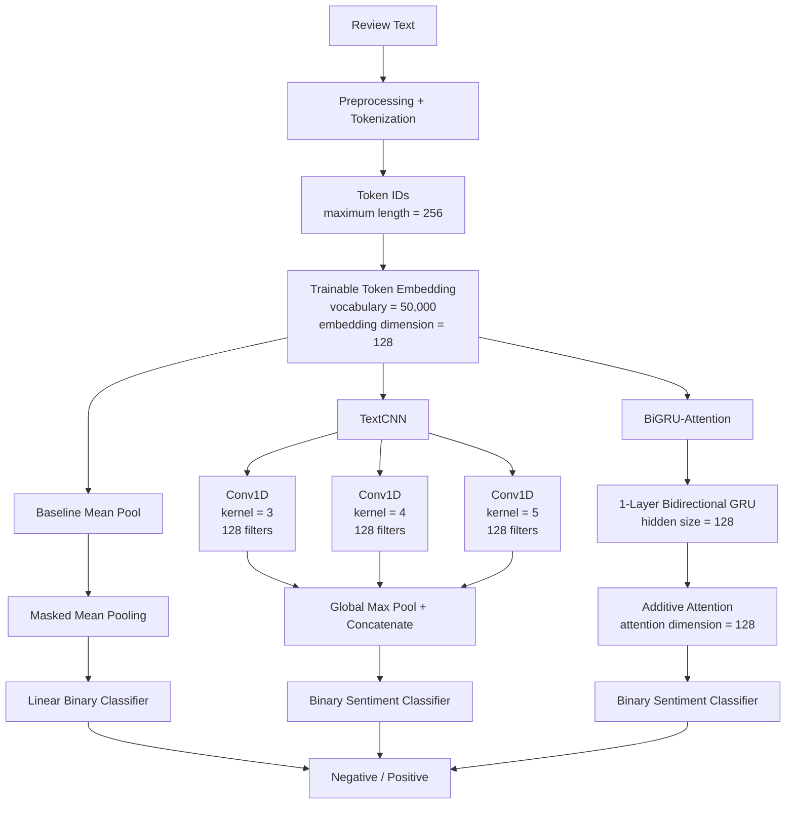
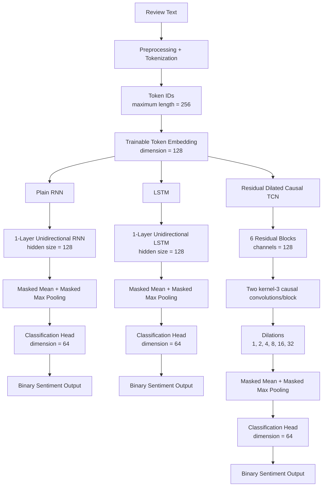

# Task 2 - Yelp Polarity Sentiment Classification

## Overview

Task 2 studies **binary sentiment classification** on the Yelp Polarity dataset using neural models trained from scratch.

The goal is to classify each Yelp review as either:

- **negative**, or
- **positive**.

The dataset used by both Team 15 members is:

- Dataset: `fancyzhx/yelp_polarity`
- Configuration: `plain_text`
- Frozen dataset revision: `bbf1c97a1f0cf005e5aded43839fd814654a1557`
- Official source training examples: 560,000
- Official test examples: 38,000
- Development training subset: 504,000
- Validation subset: 56,000
- Maximum sequence length: 256 tokens
- Training-only vocabulary size: 50,000

Both members trained their word embeddings and classifier parameters from scratch. No pretrained language model or pretrained word embedding was used.

Anshika Goel and Viraat Chaudhary explored different neural architectures. Because their architectures, preprocessing implementations, training configurations, resource environments, and some representation details differ, cross-member results should be interpreted as **descriptive comparisons of complete trained configurations**, not as controlled one-variable architecture ablations.

The official Yelp Polarity test split has already been evaluated. Reported test results are final evaluation evidence and must not be used to retune hyperparameters, change decision thresholds, redesign preprocessing, or select new checkpoints.

---

# Anshika Goel - Task 2

## Model Suite

Anshika trained three sentiment classifiers from scratch:

1. **Baseline Mean Pool**
2. **TextCNN**
3. **BiGRU-Attention**

The three models share the same training/validation split and training-only vocabulary but introduce progressively richer mechanisms for representing text.

### Baseline Mean Pool

The baseline maps each token to a learned 128-dimensional embedding, performs masked mean pooling over the model-visible review, and feeds the pooled representation to a linear sentiment classifier.

This model is intentionally order-insensitive and provides a simple lexical baseline.

### TextCNN

The TextCNN maps tokens to learned 128-dimensional embeddings and applies three parallel one-dimensional convolution banks with kernel widths:

- 3
- 4
- 5

Each kernel width uses 128 filters. Global max pooling extracts the strongest learned local phrase responses before classification.

The architecture is designed to capture local n-gram-like sentiment patterns while remaining highly parallel.

### BiGRU-Attention

The BiGRU-Attention model maps tokens to learned 128-dimensional embeddings and processes the sequence using a one-layer bidirectional GRU with hidden size 128.

An additive attention mechanism with attention dimension 128 then learns a weighted aggregation of contextual sequence representations before sentiment classification.

This model preserves word order, uses context from both sequence directions, and allows the classifier to place unequal importance on different token-level contextual states.

---

## Anshika Architecture Summary

| Model | Main architecture | Embedding | Main settings | Dropout | Parameters |
|---|---|---:|---|---:|---:|
| Baseline Mean Pool | Learned embedding → masked mean pooling → linear classifier | 128 | Order-insensitive pooling | 0.20 | 6,400,129 |
| TextCNN | Learned embedding → parallel Conv1D → global max pooling → classifier | 128 | Kernels 3/4/5, 128 filters each | 0.50 | 6,597,377 |
| BiGRU-Attention | Learned embedding → bidirectional GRU → additive attention → classifier | 128 | Hidden 128, 1 layer, bidirectional, attention 128 | 0.30 | 6,631,425 |

---

## Anshika Architecture Diagram



---

## Anshika Data and Preprocessing

The recorded Anshika configuration uses:

| Item | Value |
|---|---|
| Dataset | `fancyzhx/yelp_polarity` |
| Dataset configuration | `plain_text` |
| Dataset revision | `bbf1c97a1f0cf005e5aded43839fd814654a1557` |
| Source train examples | 560,000 |
| Training subset | 504,000 |
| Validation subset | 56,000 |
| Official test examples | 38,000 |
| Train/validation split seed | 2,662,501 |
| Vocabulary size | 50,000 |
| Minimum token frequency | 2 |
| Maximum sequence length | 256 |
| Tokenization | Regex word tokens |
| Lowercasing | Yes |
| HTML normalization | Yes |
| Whitespace normalization | Yes |
| Negation-contraction expansion | Yes |
| Punctuation removal | Yes |
| Special-character removal | Yes |
| Stopword removal | Yes |
| Preserved negations | `no`, `nor`, `not`, `never` |
| Stemming | Porter |

The vocabulary is constructed using training text only.

---

## Anshika Training Configuration

### Shared controls

- Training seed: `20260924`
- Optimizer family: AdamW
- Mixed precision: enabled
- Gradient clipping norm: `1.0`
- Warm-up ratio: `0.05`
- Minimum learning rate: `1e-5`
- Early-stopping patience: `2`
- Frozen binary decision threshold: `0.50`

### Model-specific settings

| Model | Batch size | Maximum epochs | Learning rate | Weight decay |
|---|---:|---:|---:|---:|
| Baseline Mean Pool | 512 | 5 | 0.001 | 0.0001 |
| TextCNN | 256 | 5 | 0.001 | 0.0001 |
| BiGRU-Attention | 128 | 5 | 0.0005 | 0.0001 |

The best checkpoints were selected using validation evidence rather than official-test results.

---

# Anshika Model Performance

All three models were evaluated on the same official Yelp Polarity test population of 38,000 reviews.

## Classification and Ranking Metrics

| Model | Accuracy | Macro-F1 | MCC | ROC-AUC | PR-AUC | Brier Score | ECE |
|---|---:|---:|---:|---:|---:|---:|---:|
| Baseline Mean Pool | 0.929474 | 0.929474 | 0.858947 | 0.977648 | 0.977576 | 0.053777 | 0.008339 |
| TextCNN | 0.941737 | 0.941736 | 0.883491 | 0.985671 | 0.986079 | 0.044814 | 0.017341 |
| **BiGRU-Attention** | **0.944868** | **0.944864** | **0.889869** | **0.988415** | **0.988652** | **0.040506** | **0.007061** |

Higher values are better for accuracy, F1, MCC, ROC-AUC, and PR-AUC. Lower values are better for Brier score and ECE.

---

## Anshika Confusion Matrices

The confusion-matrix ordering is:

`[[TN, FP], [FN, TP]]`

| Model | Confusion Matrix |
|---|---|
| Baseline Mean Pool | `[[17661, 1339], [1341, 17659]]` |
| TextCNN | `[[17833, 1167], [1047, 17953]]` |
| BiGRU-Attention | `[[17789, 1211], [884, 18116]]` |

---

## Anshika Resource Measurements

| Model | Parameters | Training time (s) | Mean train examples/s | Final-test examples/s |
|---|---:|---:|---:|---:|
| Baseline Mean Pool | 6,400,129 | 72.6784 | 36,636.53 | 37,655.44 |
| TextCNN | 6,597,377 | 358.8451 | 7,310.55 | 15,632.27 |
| BiGRU-Attention | 6,631,425 | 1,545.9143 | 1,401.12 | 6,407.57 |

The increasingly expressive models produced higher observed classification performance but required progressively more training time.

---

# Which Anshika Model Is Best?

For the primary observed Task 2 classification metrics, **BiGRU-Attention is Anshika's best model**.

It achieved the highest observed:

- accuracy: `0.944868`
- macro-F1: `0.944864`
- MCC: `0.889869`
- ROC-AUC: `0.988415`
- PR-AUC: `0.988652`

It also achieved the lowest:

- Brier score: `0.040506`
- ECE: `0.007061`

among Anshika's three models.

The result is consistent with the architectural advantage of preserving sequential context and using bidirectional recurrence plus attention rather than relying only on pooled lexical features or local convolution patterns.

However, this should remain an **observed descriptive conclusion**. The frozen planned McNemar family compared the baseline against TextCNN and the baseline against BiGRU-Attention, but it did not include a TextCNN-vs-BiGRU-Attention paired significance test. Therefore the repository does not establish a statistical significance claim between those two experimental models.

---

# Reproduce Anshika Task 2

The canonical Anshika implementation is notebook based.

## 1. Install Dependencies

From the repository root:

```bash
python -m pip install -r task2_sentiment/Anshika_Goel/requirements.txt
```

The recorded requirements include the exact experiment packages, including PyTorch, NumPy, pandas, scikit-learn, SciPy, Statsmodels, NLTK, Hugging Face Datasets, PyYAML, Matplotlib, and related dependencies.

## 2. Execute the Notebooks in Order

Run the notebooks under:

`task2_sentiment/Anshika_Goel/notebooks/`

in this exact sequence:

### 01 - Data Analysis and Preprocessing

```text
01_data_analysis_preprocessing.ipynb
```

This notebook:

- loads the frozen Yelp Polarity dataset;
- audits the raw data;
- constructs the deterministic train/validation split;
- preprocesses the text;
- builds the vocabulary from training data only;
- creates the fixed-length encoded arrays used by training.

### 02 - Baseline Mean Pool

```text
02_train_baseline_mean_pool.ipynb
```

This trains and validation-selects the Mean-Pool baseline and produces:

```text
checkpoints/baseline_mean_pool_best.pt
```

### 03 - TextCNN

```text
03_train_textcnn.ipynb
```

This trains and validation-selects TextCNN and produces:

```text
checkpoints/textcnn_best.pt
```

### 04 - BiGRU-Attention

```text
04_train_bigru_attention.ipynb
```

This trains and validation-selects BiGRU-Attention and produces:

```text
checkpoints/bigru_attention_best.pt
```

### 05 - Final Evaluation

```text
05_evaluate_compare_models.ipynb
```

This loads the three frozen checkpoints and performs the final official-test evaluation and model comparison.

Do not use its official-test findings to retrain or reselect models.

### 06 - Manual Error Analysis

```text
06_manual_error_analysis.ipynb
```

This performs the frozen post-hoc qualitative review of 20 predetermined BiGRU-Attention errors.

The analysis is retrospective and does not modify the trained model.

### 07 - Evaluator / Viva Verification

```text
07_evaluator_demo.ipynb
```

This independently verifies the frozen Task 2 evidence without retraining.

---

# Anshika Evaluator / Smoke Verification

Anshika's repository does **not** contain a standalone `smoke_test.py` or documented `--smoke` synthetic-inference command.

The repository-supported lightweight verification procedure is therefore the evaluator/viva notebook:

```text
task2_sentiment/Anshika_Goel/notebooks/07_evaluator_demo.ipynb
```

Run all cells and confirm the following recorded verification markers are produced:

```text
CHECKPOINT / PREDICTION PROVENANCE: PASSED
FROZEN PREDICTION CONTRACT: PASSED
TASK 2 FINAL METRIC RECOMPUTATION: PASSED
ROBUSTNESS-SLICE RECOMPUTATION: PASSED
BOOTSTRAP CI RECOMPUTATION: PASSED
MCNEMAR / HOLM RECOMPUTATION: PASSED
```

This notebook:

- verifies all three checkpoint SHA-256 hashes;
- verifies frozen prediction provenance;
- recomputes the frozen classification metrics;
- recomputes robustness-slice metrics;
- recomputes bootstrap confidence intervals;
- recomputes the planned McNemar/Holm comparisons;
- displays the frozen manual-review evidence;
- displays historical resource measurements.

It does **not** retrain the models and should not be described as a new official-test run.

The evaluator notebook verifies the committed checkpoints by hash but does not perform a fresh synthetic checkpoint forward-pass smoke test. This distinction is intentional so that the README does not claim a smoke command that does not exist in the repository.

---

## Anshika Checkpoints

| Model | Checkpoint | SHA-256 |
|---|---|---|
| Baseline Mean Pool | `Anshika_Goel/checkpoints/baseline_mean_pool_best.pt` | `4ba3b1585ff34e40cf26d74dd7a56f59d38fc8010e795046772472bf72bae724` |
| TextCNN | `Anshika_Goel/checkpoints/textcnn_best.pt` | `6f65361355ab9219177dec3b6cb482d7f7e3103ecf0f9110c3eefda42b7e2c1a` |
| BiGRU-Attention | `Anshika_Goel/checkpoints/bigru_attention_best.pt` | `da6841121a69416601fbc9fde5e2e9c32fb4cc5da4cd4a9efb758e35ab66657a` |

---

## Anshika Evidence

Primary evidence is available in:

- [`Anshika_Goel/results.md`](Anshika_Goel/results.md)
- [`Anshika_Goel/failure_analysis.md`](Anshika_Goel/failure_analysis.md)
- [`Anshika_Goel/configs/sentiment.yaml`](Anshika_Goel/configs/sentiment.yaml)
- [`Anshika_Goel/configs/final_evaluation.yaml`](Anshika_Goel/configs/final_evaluation.yaml)
- [`Anshika_Goel/outputs/metrics/final_test_metrics.json`](Anshika_Goel/outputs/metrics/final_test_metrics.json)
- [`Anshika_Goel/outputs/metrics/bootstrap_confidence_intervals.json`](Anshika_Goel/outputs/metrics/bootstrap_confidence_intervals.json)
- [`Anshika_Goel/outputs/metrics/mcnemar_tests.json`](Anshika_Goel/outputs/metrics/mcnemar_tests.json)
- [`Anshika_Goel/outputs/metrics/robustness_slice_metrics.json`](Anshika_Goel/outputs/metrics/robustness_slice_metrics.json)
- [`Anshika_Goel/notebooks/05_evaluate_compare_models.ipynb`](Anshika_Goel/notebooks/05_evaluate_compare_models.ipynb)
- [`Anshika_Goel/notebooks/06_manual_error_analysis.ipynb`](Anshika_Goel/notebooks/06_manual_error_analysis.ipynb)
- [`Anshika_Goel/notebooks/07_evaluator_demo.ipynb`](Anshika_Goel/notebooks/07_evaluator_demo.ipynb)

---

# Viraat Chaudhary - Task 2

## Model Suite

Viraat trained three sentiment classifiers from scratch:

1. **Plain RNN baseline**
2. **Unidirectional LSTM**
3. **Residual Dilated Causal TCN**

All embeddings and classifier parameters were randomly initialized and learned during sentiment training.

The RNN and LSTM intentionally share many settings so that the effect of replacing a simple recurrent unit with gated LSTM memory can be examined more directly.

The TCN replaces recurrence with a deep dilated causal convolutional representation.

---

## Viraat Architecture Summary

| Model | Main architecture | Embedding | Sequence representation | Parameters |
|---|---|---:|---|---:|
| RNN | 1-layer unidirectional RNN | 128 | Hidden size 128 | 6,450,049 |
| LSTM | 1-layer unidirectional LSTM | 128 | Hidden size 128 | 6,549,121 |
| TCN | Residual dilated causal temporal convolution network | 128 | 128 channels, six residual blocks | 7,027,969 |

All three models use:

- maximum sequence length 256;
- masked mean plus masked maximum pooling;
- classification-head dimension 64;
- embedding dropout 0.10;
- main dropout 0.25.

The RNN and LSTM contain no attention mechanism.

The TCN uses:

- channels: 128;
- six residual blocks;
- two kernel-size-3 causal convolutions per block;
- dilations: `1, 2, 4, 8, 16, 32`;
- receptive field: 253 tokens.

---

## Viraat Architecture Diagram



---

## Viraat Training Configuration

All three recorded models use:

| Setting | Value |
|---|---:|
| Vocabulary size | 50,000 |
| Sequence length | 256 |
| Embedding dimension | 128 |
| Batch size | 512 |
| Learning rate | 0.001 |
| Weight decay | 0.0001 |
| Maximum epochs | 5 |
| Early-stopping patience | 2 |
| Gradient clipping | 1.0 |
| Training seed | 2,662,503 |
| Mixed precision | CUDA FP16 AMP |
| Embedding dropout | 0.10 |
| Main dropout | 0.25 |
| Selection criterion | Validation macro-F1 |
| Tie breaker | Lower validation BCE |

The official test set is not used for model selection.

---

# Viraat Model Performance

All three models were evaluated on the same 38,000-review official Yelp Polarity test split.

## Classification and Ranking Metrics

| Model | Accuracy | Macro-F1 | MCC | ROC-AUC | PR-AUC | Brier Score | ECE |
|---|---:|---:|---:|---:|---:|---:|---:|
| RNN | 0.942658 | 0.942657 | 0.885343 | 0.986512 | 0.986900 | 0.042879 | **0.002350** |
| **LSTM** | **0.948474** | **0.948472** | **0.897019** | 0.989121 | 0.989355 | **0.038735** | 0.008854 |
| TCN | 0.948026 | 0.948021 | 0.896242 | **0.989122** | **0.989492** | 0.039448 | 0.011682 |

The TCN has a marginal advantage in ROC-AUC and PR-AUC, while the LSTM has the highest observed accuracy, macro-F1, and MCC and the lowest Brier score among Viraat's three models.

The RNN records the lowest ECE, demonstrating that the highest classification accuracy does not necessarily imply the smallest calibration error.

---

## Viraat Resource Measurements

| Model | Parameters | Training time (s) | Train examples/s | Peak CUDA allocated (MiB) |
|---|---:|---:|---:|---:|
| RNN | 6,450,049 | 46.9838 | 58,008.29 | 581.15 |
| LSTM | 6,549,121 | 57.1459 | 48,179.36 | 712.03 |
| TCN | 7,027,969 | 280.5283 | 9,414.18 | 2,738.23 |

The TCN costs approximately 4.9 times the LSTM training wall time in the recorded run and uses substantially more GPU memory.

---

# Which Viraat Model Is Best?

For the principal observed classification metrics, **Viraat's LSTM is the preferred model**.

It records the highest:

- accuracy: `0.948474`
- macro-F1: `0.948472`
- MCC: `0.897019`

It also has a lower Brier score than the TCN and requires substantially less training time and GPU memory.

The TCN remains competitive:

- ROC-AUC is marginally higher than the LSTM;
- PR-AUC is marginally higher than the LSTM;
- it performs particularly well on the recorded long-review slice.

However, those advantages come with much greater computational cost and do not produce higher overall accuracy or macro-F1.

The LSTM therefore offers the strongest observed **performance-efficiency balance** among Viraat's three runs.

A statistical boundary is important: no LSTM-vs-TCN paired significance test was reported. The small observed difference between the two models therefore does not establish that the LSTM architecture is intrinsically superior to the TCN architecture.

---

# Reproduce Viraat Task 2

The canonical Viraat workflow is documented in:

- [`Viraat_Chaudhary/README.md`](Viraat_Chaudhary/README.md)
- [`Viraat_Chaudhary/RUN_ORDER.md`](Viraat_Chaudhary/RUN_ORDER.md)

## 1. Install Dependencies

From the repository root:

```bash
python -m pip install -r task2_sentiment/Viraat_Chaudhary/requirements.txt
```

## 2. Complete Notebook Workflow

The recorded notebook sequence is:

| Order | Notebook | Purpose |
|---:|---|---|
| 01 | `Viraat_01_data_analysis_preprocessing.ipynb` | Preprocess and verify Yelp data |
| 02 | `Viraat_02_train_baseline.ipynb` | Train/resume plain RNN |
| 03 | `Viraat_03_train_experiment_1.ipynb` | Train/resume unidirectional LSTM |
| 04 | `Viraat_04_train_experiment_2.ipynb` | Train/resume residual causal TCN and freeze selected checkpoints |
| 05 | `Viraat_05_evaluate_compare_models.ipynb` | Frozen official-test inference, metrics, statistics, slices, and comparisons |
| 06 | `Viraat_06_manual_error_analysis.ipynb` | Perform the frozen 20-error analysis |
| 07 | `Viraat_07_evaluator_demo.ipynb` | CPU checkpoint evaluator and final artifact audit/export |

The original workflow was executed in Colab.

The recorded procedure uses:

- A100 GPU for notebooks 02-05;
- CPU is sufficient for notebooks 06-07;
- persistent Drive artifacts so interrupted training can resume;
- validation-selected checkpoints;
- official-test results only after all three models are frozen.

Do not use the already-observed test results for further tuning.

---

# Viraat Smoke Test

Unlike Anshika's notebook-only evaluator verification, Viraat provides an explicit standalone checkpoint smoke command.

From the repository root, first install dependencies:

```bash
python -m pip install -r task2_sentiment/Viraat_Chaudhary/requirements.txt
```

Then run:

```bash
python task2_sentiment/Viraat_Chaudhary/src/evaluator.py --smoke --config task2_sentiment/Viraat_Chaudhary/configs/baseline.json
```

The smoke test:

- runs on CPU;
- loads the selected saved RNN checkpoint;
- loads the frozen preprocessing/vocabulary;
- verifies checkpoint/config integrity;
- processes synthetic sentences;
- emits valid sentiment probabilities;
- requires no Yelp dataset download;
- does not recompute official-test accuracy.

The supplied executed `Viraat_07_evaluator_demo.ipynb` additionally records successful CPU smoke evaluation for all three frozen checkpoints.

This smoke procedure is intended to verify that the saved model artifacts can be loaded and used for inference, not to create a new test-set measurement.

---

## Viraat Evidence

Primary evidence is available in:

- [`Viraat_Chaudhary/README.md`](Viraat_Chaudhary/README.md)
- [`Viraat_Chaudhary/results.md`](Viraat_Chaudhary/results.md)
- [`Viraat_Chaudhary/failure_analysis.md`](Viraat_Chaudhary/failure_analysis.md)
- [`Viraat_Chaudhary/RUN_ORDER.md`](Viraat_Chaudhary/RUN_ORDER.md)
- [`Viraat_Chaudhary/metrics_report.csv`](Viraat_Chaudhary/metrics_report.csv)
- [`Viraat_Chaudhary/outputs/metrics/final_test_metrics.json`](Viraat_Chaudhary/outputs/metrics/final_test_metrics.json)
- [`Viraat_Chaudhary/outputs/metrics/checkpoint_result_mapping.json`](Viraat_Chaudhary/outputs/metrics/checkpoint_result_mapping.json)
- [`Viraat_Chaudhary/outputs/metrics/mcnemar_tests.json`](Viraat_Chaudhary/outputs/metrics/mcnemar_tests.json)
- [`Viraat_Chaudhary/outputs/metrics/bootstrap_confidence_intervals.json`](Viraat_Chaudhary/outputs/metrics/bootstrap_confidence_intervals.json)
- [`Viraat_Chaudhary/outputs/metrics/robustness_slice_metrics.json`](Viraat_Chaudhary/outputs/metrics/robustness_slice_metrics.json)
- [`Viraat_Chaudhary/outputs/metrics/evaluator_smoke.json`](Viraat_Chaudhary/outputs/metrics/evaluator_smoke.json)
- [`Viraat_Chaudhary/notebooks/Viraat_07_evaluator_demo.ipynb`](Viraat_Chaudhary/notebooks/Viraat_07_evaluator_demo.ipynb)

---

# Team 15 Task 2 Model Comparison

The table below compares the principal observed official-test metrics for all six Task 2 models.

| Member | Model | Accuracy | Macro-F1 | MCC |
|---|---|---:|---:|---:|
| Anshika | Mean Pool | 0.929474 | 0.929474 | 0.858947 |
| Anshika | TextCNN | 0.941737 | 0.941736 | 0.883491 |
| Anshika | **BiGRU-Attention** | **0.944868** | **0.944864** | **0.889869** |
| Viraat | RNN | 0.942658 | 0.942657 | 0.885343 |
| Viraat | **LSTM** | **0.948474** | **0.948472** | **0.897019** |
| Viraat | TCN | 0.948026 | 0.948021 | 0.896242 |

---

# Which Task 2 Model Is Best Overall?

Among the six **observed trained runs**, **Viraat Chaudhary's LSTM has the highest official-test accuracy, macro-F1, and MCC**.

Its recorded values are:

- accuracy: `0.948474`
- macro-F1: `0.948472`
- MCC: `0.897019`
- ROC-AUC: `0.989121`
- PR-AUC: `0.989355`
- Brier score: `0.038735`

Therefore, if the selection criterion is overall observed binary classification performance on the official Yelp Polarity test population, the **Viraat LSTM is the strongest recorded Task 2 model**.

The difference between Viraat's LSTM and TCN is small:

- LSTM accuracy: `0.948474`
- TCN accuracy: `0.948026`

The LSTM also trains substantially faster and uses much less GPU memory than the TCN, strengthening its observed performance-efficiency tradeoff.

The TCN nevertheless has marginally higher ROC-AUC and PR-AUC and stronger recorded performance on the long-review slice.

---

## Cross-Member Scientific Boundary

The six-model table is useful for **descriptive comparison**, but it is not a controlled experiment proving that the LSTM architecture is intrinsically better than BiGRU-Attention, TextCNN, or TCN.

Reasons include:

- member-specific preprocessing implementations;
- potentially different token-level representations and resulting slice memberships;
- different architectures and parameter counts;
- different training configurations;
- different hardware and execution environments;
- lack of aligned cross-member paired significance testing;
- single-run rather than multi-seed comparison.

Therefore the defensible conclusions are:

1. **Anshika's BiGRU-Attention is the best observed model among Anshika's three models.**
2. **Viraat's LSTM is the best observed model on the principal classification metrics among Viraat's three models.**
3. **Viraat's LSTM has the highest observed accuracy, macro-F1, and MCC in the six-model Task 2 table.**
4. **The cross-member results do not isolate architecture causality.**

---

# Reproducibility Directory

Task-scoped reproducibility evidence is stored under:

[`reproducibility/`](reproducibility/)

The directory contains separate evidence bundles for:

- [`reproducibility/Anshika_Goel/`](reproducibility/Anshika_Goel/)
- [`reproducibility/Viraat_Chaudhary/`](reproducibility/Viraat_Chaudhary/)

These reproducibility directories preserve selected configurations, manifests, requirements, logs, and provenance evidence.

The canonical notebooks, checkpoints, outputs, results, and implementation files remain in the sibling member directories:

```text
task2_sentiment/
├── Anshika_Goel/
├── Viraat_Chaudhary/
├── data/
└── reproducibility/
```

Execute the experiments from the canonical member directories rather than from the reproducibility evidence copies.

---

# Final Task 2 Summary

Task 2 demonstrates several approaches to sentiment classification without pretrained embeddings or pretrained language models.

Anshika progresses from an order-insensitive Mean-Pool baseline to a TextCNN and then to a contextual BiGRU-Attention model. BiGRU-Attention records her strongest observed official-test results with approximately **94.49% accuracy** and **94.49% macro-F1**.

Viraat compares a plain RNN, an LSTM, and a residual dilated causal TCN. The LSTM records approximately **94.85% accuracy** and **94.85% macro-F1**, giving it the strongest observed principal classification metrics in Viraat's model suite and in the six-model Team 15 comparison.

The TCN remains competitive in ranking metrics and long-review performance but requires substantially more computation. The simpler RNN and Mean-Pool models provide useful baseline evidence showing the improvement obtained by more expressive sequence and local-context architectures.

Overall, **Viraat's LSTM is the highest-performing observed Task 2 model on accuracy, macro-F1, and MCC**, while **Anshika's BiGRU-Attention is the strongest model within Anshika's experiments**.

These are empirical results for the recorded runs and should not be interpreted as universal claims that one architecture family is intrinsically superior.