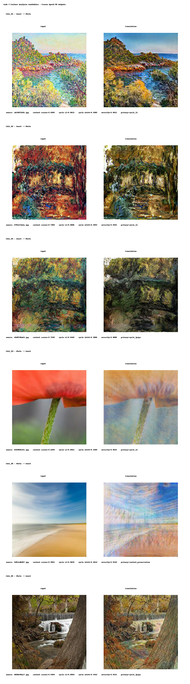
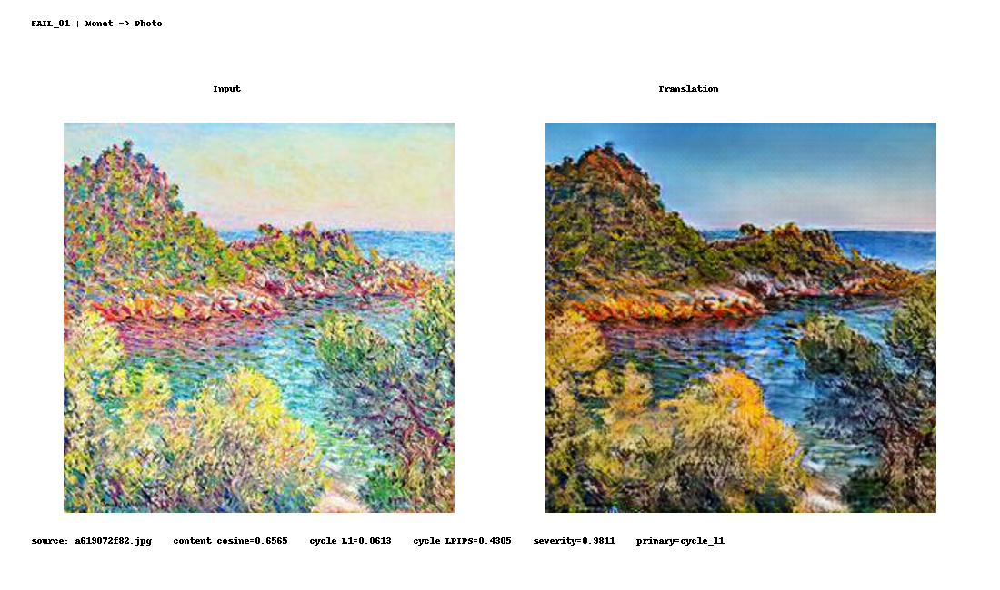
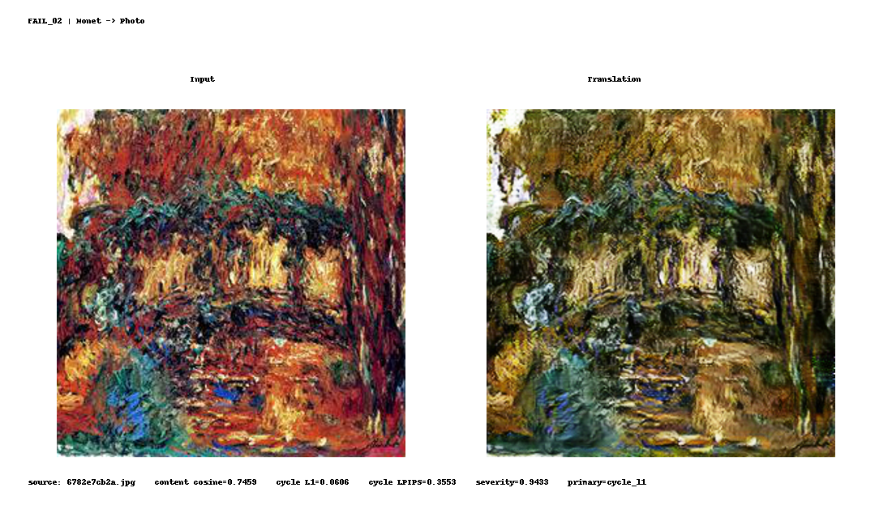
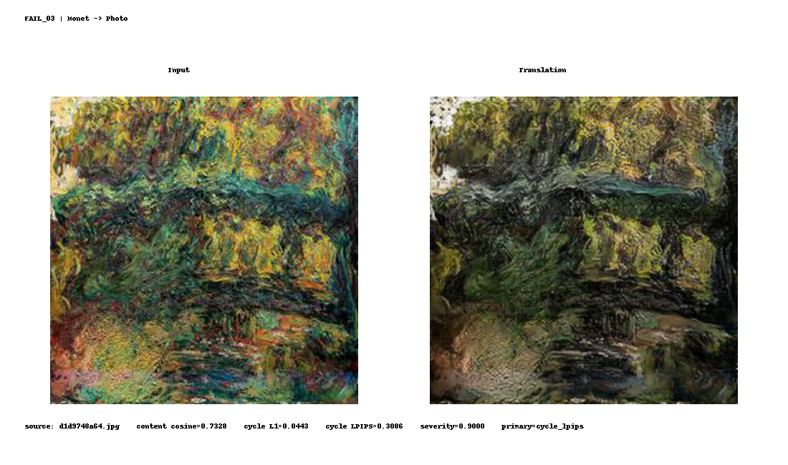
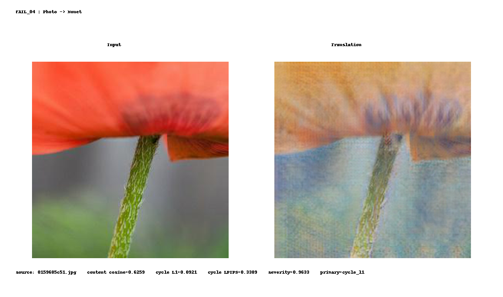
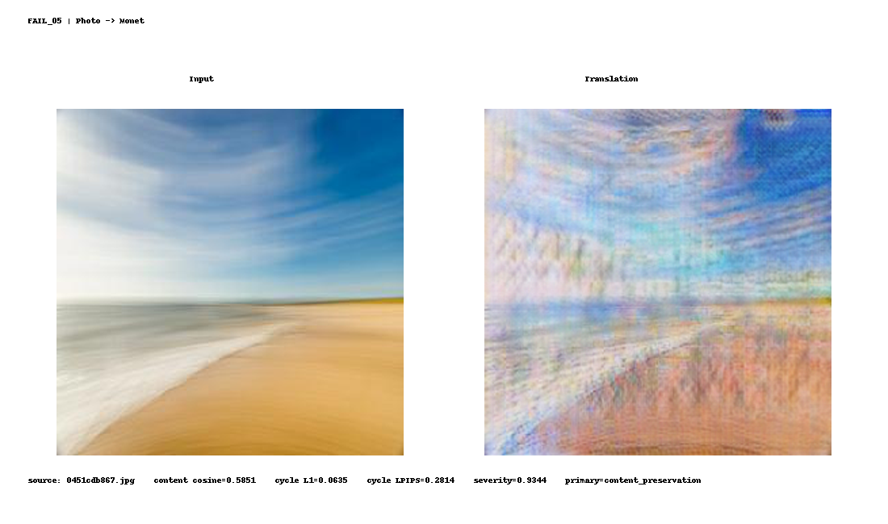
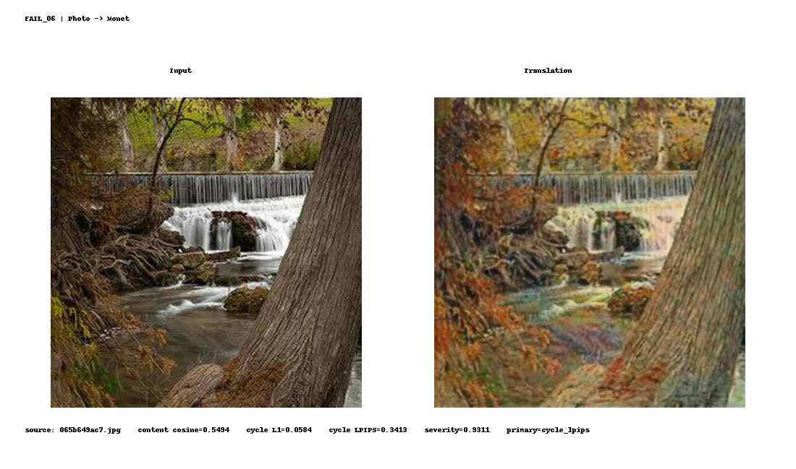

# Task 3 Failure Analysis — Anshika Goel

## 1. Purpose

This document analyzes concrete weaknesses in the frozen epoch-50 CycleGAN outputs used for Task 3 evaluation.

The examples were **not manually cherry-picked first and then justified afterward**. Instead, all 600 frozen translations were ranked using preserved per-sample evaluation metrics, and the three highest-severity cases from each translation direction were selected deterministically.

The six analyzed cases therefore consist of:

- 3 Monet → Photo examples;
- 3 Photo → Monet examples.

No new CycleGAN inference was performed for this analysis.

---

## 2. Failure-Case Selection Protocol

Three per-sample signals were combined:

1. **Content-preservation cosine similarity**
   - lower similarity indicates greater source/translation feature drift;

2. **Cycle-reconstruction L1**
   - higher reconstruction error indicates weaker pixel-space cycle recovery;

3. **Cycle LPIPS**
   - higher LPIPS indicates weaker perceptual cycle reconstruction.

Because these metrics have different numerical scales, each signal was converted to a **within-direction percentile**.

Failure severity was defined as the mean of:

- content-failure percentile;
- cycle-L1 failure percentile;
- cycle-LPIPS failure percentile.

The top three samples were then selected independently for A2B and B2A.

This selection protocol is recorded in:

- `outputs/failure_analysis/failure_case_candidates_all.csv`
- `outputs/failure_analysis/selected_failure_cases.csv`

The complete visual contact sheet is:

---

# 3. Monet → Photo Failure Cases

## FAIL_01 — Content and Geometry Drift

- Source file: `a619072f82.jpg`
- Content cosine similarity: **0.656524**
- Cycle L1 [0,1]: **0.061300**
- Cycle LPIPS: **0.430524**
- Composite failure severity: **0.981111**
- Primary metric signal: **cycle_l1**

### Visual observation

The input contains a highly textured Monet-style coastal scene. The translated output moves strongly toward photographic color and texture, but the transformation also alters scene structure.

The rocky formation becomes more explicit and geometrically different, and parts of the shoreline and foreground texture are reorganized rather than merely restyled.

The source scene remains recognizable, but this example demonstrates that the generator can partially change **content geometry while performing the domain transformation**.

This agrees with the relatively low content cosine similarity of **0.657** and the very high composite failure severity.

### Failure type

**Content / geometry drift during style translation**

### Testable improvement

A controlled experiment could increase the cycle-consistency weight from the current value of 10 to, for example, **12.5 or 15**, while leaving the remaining training setup unchanged.

The hypothesis would be that stronger cycle pressure reduces structural drift.

The test should compare:

- content cosine similarity;
- cycle L1;
- FID/KID;

to determine whether improved structural preservation causes an unacceptable loss of target-domain realism.

---

## FAIL_02 — Incomplete Translation Toward the Photo Domain

- Source file: `6782e7cb2a.jpg`
- Content cosine similarity: **0.745892**
- Cycle L1 [0,1]: **0.060554**
- Cycle LPIPS: **0.355302**
- Composite failure severity: **0.943333**
- Primary metric signal: **cycle_l1**

### Visual observation

The source is strongly painterly and abstract.

Although the translated image changes its color balance and local appearance, it still retains a clearly painted appearance rather than becoming convincingly photographic.

Large regions remain smeared and texture-heavy, and the output contains limited realistic material or edge structure.

This is therefore less a case of catastrophic content destruction and more a case of **insufficient domain conversion**.

### Failure type

**Under-translation / residual source-domain appearance**

### Testable improvement

The production artifact was evaluated at epoch 50 even though the canonical configuration defines a 200-epoch schedule.

A direct experiment would therefore be to complete the originally configured training schedule, including its later learning-rate decay, and compare the same frozen evaluation set at epochs 50, 100, 150, and 200.

The hypothesis is that additional training may strengthen the A2B domain shift without changing the architecture.

---

## FAIL_03 — Texture Smearing and Loss of Fine Detail

- Source file: `d1d9748a64.jpg`
- Content cosine similarity: **0.732753**
- Cycle L1 [0,1]: **0.044273**
- Cycle LPIPS: **0.308649**
- Composite failure severity: **0.900000**
- Primary metric signal: **cycle_lpips**

### Visual observation

The translated image preserves the broad scene layout, but the output remains visually painterly and becomes darker and muddier.

Fine structures visible in the input merge into larger dark texture regions, reducing local detail and separation between objects.

The output therefore shows both incomplete photo-domain conversion and **loss of fine-scale structure**.

The primary metric signal for this case was cycle LPIPS, which is consistent with a perceptual rather than purely pixel-level reconstruction weakness.

### Failure type

**Perceptual detail loss / under-translation**

### Testable improvement

The first controlled test should again be completion of the configured training schedule.

A second experiment could compare the current identity-loss ratio of 0.5 with a lower value such as **0.25**.

The purpose would be to test whether reduced identity pressure allows stronger target-domain conversion.

This should only be accepted if FID/KID improve without causing worse content cosine similarity or cycle reconstruction.

---

# 4. Photo → Monet Failure Cases

## FAIL_04 — Structure Softening and Color Bleeding

- Source file: `0159685c51.jpg`
- Content cosine similarity: **0.625903**
- Cycle L1 [0,1]: **0.092060**
- Cycle LPIPS: **0.338949**
- Composite failure severity: **0.963333**
- Primary metric signal: **cycle_l1**

### Visual observation

The input is a close-up photograph with a strongly defined red flower and narrow green stem.

The translated image does move clearly toward a Monet-like representation, but the flower boundary becomes diffuse and large portions of the red region are replaced by washed pastel texture.

The stem remains visible, so the principal object is preserved, but local edges and color boundaries are substantially weakened.

### Failure type

**Structural softening / color bleeding**

### Testable improvement

A stronger cycle-consistency setting can be tested specifically on high-edge-content images such as this sample.

A useful ablation would compare:

- lambda cycle = 10;
- lambda cycle = 12.5;
- lambda cycle = 15.

The desired result would be stronger preservation of object boundaries while maintaining the B2A target style.

---

## FAIL_05 — Strong Texture Artifacts

- Source file: `0451cdb867.jpg`
- Content cosine similarity: **0.585141**
- Cycle L1 [0,1]: **0.063469**
- Cycle LPIPS: **0.281352**
- Composite failure severity: **0.934444**
- Primary metric signal: **content_preservation**

### Visual observation

The original photograph has a simple beach, horizon, and sky structure.

The translation preserves the basic scene concept, but it introduces pronounced repeated streaks and radiating texture patterns over large portions of the image.

The output therefore becomes Monet-like, but part of the stylization behaves more like a structured rendering artifact than natural brush texture.

Among the six selected examples, this is one of the clearest visible artifact failures.

Its primary ranking signal was content preservation rather than cycle L1 or LPIPS, which also illustrates that the three automatic signals do not always identify the same visual problem.

### Failure type

**Texture / streaking artifact**

### Testable improvement

Because the evaluated checkpoint was produced during the constant-learning-rate portion of the configured schedule, one important experiment is to continue training through the intended learning-rate decay phase.

The hypothesis is that lower later-stage learning rates could permit finer generator/discriminator adjustments and reduce unstable high-frequency texture patterns.

The same sample should be regenerated from fixed later checkpoints to determine whether the artifact decreases consistently rather than relying on anecdotal inspection.

---

## FAIL_06 — Fine-Detail Loss with Otherwise Preserved Content

- Source file: `065b649ac7.jpg`
- Content cosine similarity: **0.549411**
- Cycle L1 [0,1]: **0.058433**
- Cycle LPIPS: **0.341290**
- Composite failure severity: **0.931111**
- Primary metric signal: **cycle_lpips**

### Visual observation

The input contains a waterfall, surrounding rocks, vegetation, and a large tree.

Unlike some of the other selected examples, the principal scene structure remains clearly recognizable after translation.

However, the output softens fine edges, merges some local textures, and reduces structural crispness around the water, rocks, and background.

This is therefore a **subtle failure rather than a catastrophic one**.

Importantly, this case demonstrates a limitation of automatic failure ranking: it received a high composite severity score, especially from cycle LPIPS, even though its direct translation remains visually understandable and content-preserving.

### Failure type

**Fine-detail loss / metric–visual mismatch**

### Testable improvement

A resolution ablation could test whether training and evaluation at a higher spatial resolution preserves more local edge information.

This would require a separate controlled training run because changing image resolution also changes computation and discriminator behavior.

The result should be judged using both:

- content/perceptual metrics;
- fixed visual examples such as FAIL_06.

---

# 5. Cross-Case Findings

The six cases reveal several distinct failure modes rather than one universal weakness.

### A2B: Monet → Photo

The A2B failures primarily show:

- incomplete removal of painterly appearance;
- perceptual texture smearing;
- occasional scene-geometry drift.

This agrees with the full evaluation, where A2B achieved higher generative precision but substantially lower recall than B2A. The model can generate outputs inside parts of the photo-domain manifold, but it does not cover that domain equally well for every input.

### B2A: Photo → Monet

The B2A examples show:

- color bleeding;
- softened boundaries;
- stylization artifacts;
- loss of fine-scale photographic detail.

At the same time, B2A achieved better distribution-level FID/KID and higher generative recall than A2B. This indicates that stronger aggregate target-domain alignment does not guarantee that every individual translation will be artifact-free.

---

# 6. Metric and Visual Failure Analysis Are Complementary

The failure selection method was intentionally quantitative, but the contact sheet shows why automatic metrics should not be treated as a substitute for visual inspection.

For example:

- FAIL_05 contains an obvious visible texture artifact;
- FAIL_01 shows meaningful structural/content drift;
- FAIL_06 receives a high metric-based severity score even though its overall scene remains visually well preserved.

Therefore, the composite score is useful for **finding suspicious samples**, but the final failure label should still be based on the actual translated image.

This is also why the analysis does not claim that the six samples are objectively the six visually worst outputs. They are the six **highest-severity samples under the documented metric-selection protocol**.

---

# 7. Broader Model Limitations

Several broader limitations contribute to these failures:

1. **Training stopped at epoch 50.**  
   The canonical experiment configuration defines a 200-epoch schedule, but the evaluated model is the preserved epoch-50 checkpoint.

2. **Unpaired supervision.**  
   There is no ground-truth paired target image telling the model exactly how an individual Monet should look as a photograph or how a particular photograph should look as a Monet.

3. **Cycle consistency does not guarantee perfect semantic preservation.**  
   A forward generator and reverse generator can sometimes compensate for each other's transformations while still altering information in the intermediate translated image.

4. **Target-domain realism and source-content preservation can conflict.**  
   Stronger stylization can improve distribution-level similarity while simultaneously changing edges, textures, colors, or geometry.

5. **Evaluation metrics capture different properties.**  
   FID/KID measure distributions, cosine similarity measures feature-space correspondence, L1 measures pixel reconstruction, and LPIPS measures perceptual reconstruction. No single metric fully represents translation quality.

---

# 8. Priority Follow-Up Experiments

Based on the observed failures, the most useful next experiments would be:

1. **Complete the full configured training schedule** and evaluate fixed checkpoints at epochs 50, 100, 150, and 200.
2. **Increase cycle-consistency weight** in a controlled ablation to test structural preservation.
3. **Test a lower identity-loss ratio** for A2B to determine whether it improves photo-domain conversion.
4. **Evaluate a higher-resolution model** for fine-detail preservation.
5. Keep the exact same frozen evaluation subset and failure examples across experiments so improvements are directly comparable.

These are proposed experiments, not claims that they have already been performed.

---

# 9. Evidence

Primary failure-analysis artifacts:

- `outputs/failure_analysis/failure_case_candidates_all.csv`
- `outputs/failure_analysis/selected_failure_cases.csv`
- `outputs/failure_analysis/FAIL_01.png`
- `outputs/failure_analysis/FAIL_02.png`
- `outputs/failure_analysis/FAIL_03.png`
- `outputs/failure_analysis/FAIL_04.png`
- `outputs/failure_analysis/FAIL_05.png`
- `outputs/failure_analysis/FAIL_06.png`
- `outputs/failure_analysis/failure_cases_contact_sheet.png`

Underlying per-sample metrics:

- `outputs/metrics/content_preservation_cosine_per_sample.csv`
- `outputs/metrics/cycle_reconstruction_l1_per_sample.csv`
- `outputs/metrics/cycle_reconstruction_lpips_per_sample.csv`

All six panels use the already-frozen epoch-50 direct translations. No new inference, image editing, or output substitution was performed for the failure analysis.

