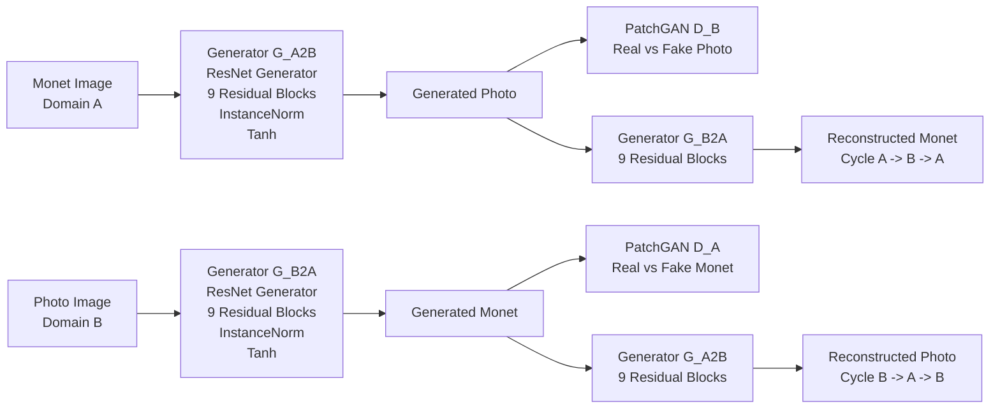
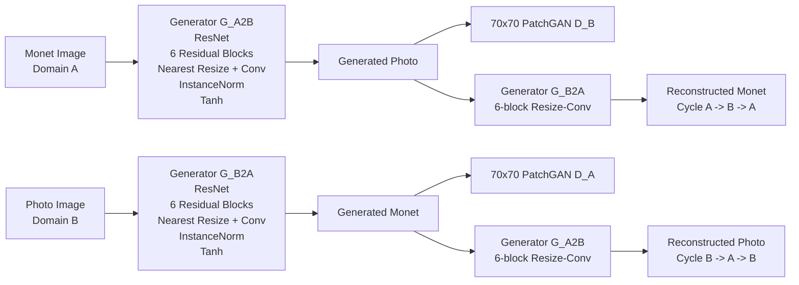

# Task 3 - CycleGAN Monet/Photo Image Translation

## Task Overview

Task 3 implements **unpaired image-to-image translation** between two visual
domains:

- **Domain A:** Monet paintings
- **Domain B:** photographs

The task uses the CycleGAN framework so that paired Monet/photo examples are not
required during training.

The two translation directions are:

- **A -> B:** Monet -> Photo
- **B -> A:** Photo -> Monet

The expected local data directories are:

```text
task3_gan/data/monet_jpg/
task3_gan/data/photo_jpg/
```

The dataset contains approximately:

- 300 Monet images
- 7,038 photograph images

The raw image dataset is intentionally not stored in the Git repository.

Both Team 15 implementations train CycleGAN models from scratch and contain:

- two generators;
- two discriminators;
- least-squares adversarial loss;
- cycle-consistency loss;
- identity loss;
- unpaired training;
- direct generation in both translation directions.

Neither final submission-generation pipeline uses a pretrained or foundation
image generator.

The two team members implemented materially different final CycleGAN
configurations:

- **Anshika Goel:** 9-block ResNet generators with the final selected checkpoint
  at epoch 125.
- **Viraat Chaudhary:** 6-block resize-convolution ResNet generators trained for
  60 epochs.

These two runs provide a useful comparison, but they are **not a controlled
single-variable architecture ablation**. Generator depth, upsampling,
identity-loss weighting, batch size, precision mode, and training schedule differ
simultaneously.

---

# Anshika Goel - Task 3

## Anshika Model Overview

Anshika implemented an unpaired CycleGAN for bidirectional Monet/photo image
translation.

The final selected production run is:

```text
cyclegan_baseline_rtx4090_run001
```

The final selected checkpoint is:

```text
Anshika_Goel/checkpoints/cyclegan_baseline_rtx4090_run001/epoch_0125.pt
```

The checkpoint corresponds to:

```text
epoch       = 125
global step = 879750
```

The checkpoint binary is retained locally and Git-ignored because of its size.
Checkpoint identity, manifests, hashes, configuration, training logs, evaluator
evidence, and final result artifacts are preserved in the repository.

The recorded checkpoint SHA-256 is:

```text
3216b4997ed51962590251170ca5cbd6d00fb444479a8b5cd9480f0cfbeab7ec
```

Primary member documentation:

- [Anshika README](Anshika_Goel/README.md)
- [Anshika final results](Anshika_Goel/results.md)
- [Anshika failure analysis](Anshika_Goel/failure_analysis.md)
- [Anshika CycleGAN configuration](Anshika_Goel/configs/cyclegan_baseline.json)

---

## Anshika Architecture Summary

Anshika's CycleGAN contains four trainable neural networks:

1. Generator `G_A2B`
   - Monet -> Photo

2. Generator `G_B2A`
   - Photo -> Monet

3. Discriminator `D_A`
   - distinguishes real Monet images from generated Monet-style images

4. Discriminator `D_B`
   - distinguishes real photographs from generated photographs

Both generators use the same **9-residual-block ResNet generator**
architecture.

Generator characteristics:

| Property | Value |
|---|---|
| Generator family | ResNet |
| Number of generators | 2 |
| Input channels | 3 |
| Output channels | 3 |
| Base channels | 64 |
| Residual blocks | 9 |
| Normalization | Instance normalization |
| Output activation | Tanh |
| Weight initialization | Normal distribution, mean 0, std 0.02 |

Both discriminators use PatchGAN.

Discriminator characteristics:

| Property | Value |
|---|---|
| Discriminator family | 70x70 PatchGAN |
| Number of discriminators | 2 |
| Input channels | 3 |
| Base channels | 64 |
| Discriminator layers | 3 |
| Normalization | Instance normalization |

The total number of trainable parameters across both generators and both
discriminators is:

```text
28,285,832
```

---

## Anshika Architecture Diagram



The adversarial discriminators encourage translated images to resemble their
target domains, while the two reconstruction paths enforce cycle consistency.

---

## Anshika Loss Functions

The training objective combines three principal components.

### Least-Squares GAN Loss

The adversarial objective is:

```text
least_squares_gan_mse
```

Both generators attempt to create translations that the corresponding PatchGAN
discriminator classifies as belonging to the target domain.

### Cycle-Consistency Loss

Cycle consistency uses L1 reconstruction loss.

Configured weights:

```text
lambda_cycle_a = 10
lambda_cycle_b = 10
```

For example:

```text
Monet -> Photo -> Monet
```

should reconstruct the original Monet image.

Likewise:

```text
Photo -> Monet -> Photo
```

should reconstruct the original photograph.

### Identity Loss

Identity mapping also uses L1 loss.

Anshika's identity ratio is:

```text
0.5
```

giving effective identity weights:

```text
Domain A = 5.0
Domain B = 5.0
```

Identity loss discourages unnecessary changes when an image is already from the
generator's target domain.

---

## Anshika Training Configuration

The canonical configuration is:

[Anshika `cyclegan_baseline.json`](Anshika_Goel/configs/cyclegan_baseline.json)

Important settings are:

| Setting | Value |
|---|---|
| Training type | Unpaired |
| Train resize | 286 |
| Random crop | 256 x 256 |
| Evaluation size | 256 x 256 |
| Horizontal flip probability | 0.5 |
| Normalized range | [-1, 1] |
| Batch size | 1 |
| Precision | FP32 |
| Optimizer | Adam |
| Learning rate | 0.0002 |
| Adam beta1 | 0.5 |
| Adam beta2 | 0.999 |
| Replay image pool | 50 |
| Cycle weight | 10 per direction |
| Effective identity weight | 5 per direction |
| Configured constant-LR epochs | 100 |
| Configured linear-decay epochs | 100 |
| Configured maximum schedule | 200 epochs |
| Selected final checkpoint | Epoch 125 |

The configuration defines a possible 200-epoch training schedule, but the final
reported model is specifically the **selected epoch-125 checkpoint**. Results in
this README therefore refer to epoch 125 rather than claiming that the entire
configured 200-epoch schedule was completed.

Serious production training was performed on an NVIDIA GeForce RTX 4090.

---

# Anshika Model Performance

## Final Training State

The final selected epoch-125 run recorded:

| Property | Value |
|---|---:|
| Completed epochs | 125 |
| Final global step | 879,750 |
| Trainable parameters | 28,285,832 |
| Recorded training duration | 27.8685 hours |
| Weighted throughput | 17.5377 images/sec |
| Non-finite gradient events | 0 |

The zero recorded non-finite-gradient count is useful stability evidence, but it
should not by itself be interpreted as proof of image quality.

---

## Official Instructor Evaluation

The unchanged instructor evaluator produced the following final average metrics:

| Metric | Final value |
|---|---:|
| FID | **97.466148498** |
| MiFID | **0.406865570** |

The direct comparison pipeline produced the following directional results:

| Metric | Monet -> Photo | Photo -> Monet | Mean |
|---|---:|---:|---:|
| FID | **96.068450** | 98.864013 | 97.466231 |
| MiFID | 0.413548 | **0.400183** | 0.406866 |
| KID | 0.017190 | 0.007900 | 0.012545 |
| Generative precision | 0.7800 | 0.4333 | 0.6067 |
| Generative recall | 0.3333 | 0.6300 | 0.4817 |

The tiny difference between the mean directional FID/MiFID calculations and the
official notebook values is recorded as numerical implementation tolerance.

For this project, the official instructor evaluator remains the canonical source
for the reported final FID/MiFID result.

---

## Cycle Reconstruction Quality

Cycle consistency was also evaluated directly.

| Metric | A -> B -> A | B -> A -> B | Mean |
|---|---:|---:|---:|
| Cycle L1 | 0.032256 | 0.034622 | **0.033439** |
| LPIPS AlexNet | 0.182873 | 0.134368 | **0.158620** |

LPIPS uses:

```text
lpips == 0.1.4
backbone = AlexNet
```

with a fixed evaluation set of 300 source images per direction.

Lower cycle reconstruction distance indicates that the round-trip translation
more closely preserves the original image.

---

## Content-Preservation Proxy

Inception feature cosine similarity between the source image and its translated
image was recorded as:

| Direction | Inception cosine similarity |
|---|---:|
| Monet -> Photo | 0.783451 |
| Photo -> Monet | 0.754759 |
| Mean | **0.769105** |

This is a feature-space proxy for content preservation and should not be treated
as a perfect semantic-content metric.

---

## Kaggle Result

The final epoch-125 submission produced:

```text
Team: PairProgramming_Team_15
Score: -48.9365
Leaderboard rank snapshot: 14
Previous best score: -49.2903
```

Kaggle identified the epoch-125 submission as a new personal best.

The leaderboard rank is a time-specific snapshot rather than a permanent model
property.

---

# Which Anshika Model Is Best?

Anshika's final selected model is the **epoch-125 checkpoint**.

The final checkpoint was selected after deterministic checkpoint comparison.
The repository preserves earlier checkpoint-evaluation evidence so that the
selection is not based solely on the final result.

Relative to the earlier reported checkpoint results, epoch 125 improved:

- official FID;
- official MiFID;
- Kaggle score.

Therefore, for Anshika's Task 3 work, the appropriate final model is:

```text
cyclegan_baseline_rtx4090_run001
epoch_0125.pt
```

This conclusion is a **checkpoint-selection conclusion within Anshika's
training run**, not evidence that training indefinitely would continue improving
all metrics.

---

# Reproduce Anshika Task 3

## 1. Restore the Dataset

The raw images must be available locally at:

```text
task3_gan/data/monet_jpg/
task3_gan/data/photo_jpg/
```

The dataset is not committed to Git.

---

## 2. Install the Recorded Dependencies

From the repository root:

```powershell
python -m pip install -r task3_gan\Anshika_Goel\configs\requirements_task3.txt
```

The repository also preserves environment snapshots under:

```text
Anshika_Goel/configs/
```

including production and local-development package/environment information.

---

## 3. Use the Canonical Configuration

The canonical configuration is:

```text
task3_gan/Anshika_Goel/configs/cyclegan_baseline.json
```

It records:

- model architecture;
- preprocessing;
- optimizer configuration;
- loss weights;
- checkpoint policy;
- monitoring policy;
- intended training schedule.

---

## 4. Training Implementation

The canonical training implementation is under:

```text
task3_gan/Anshika_Goel/code/
```

Important files include:

- [`models.py`](Anshika_Goel/code/models.py)
- [`train.py`](Anshika_Goel/code/train.py)
- [`trainer.py`](Anshika_Goel/code/trainer.py)
- [`training_loop.py`](Anshika_Goel/code/training_loop.py)
- [`training_utils.py`](Anshika_Goel/code/training_utils.py)

A full new training run requires the raw Monet and photograph domains to be
restored locally.

The audit evidence does not establish one single canonical CLI invocation with
all arguments for a complete new production training run, so this task-level
README does not invent one. Use the member README, canonical configuration and
training entry point together when rerunning training.

---

## 5. Recorded Final Checkpoint

The final recorded production checkpoint is:

```text
task3_gan/Anshika_Goel/checkpoints/cyclegan_baseline_rtx4090_run001/epoch_0125.pt
```

Recorded SHA-256:

```text
3216b4997ed51962590251170ca5cbd6d00fb444479a8b5cd9480f0cfbeab7ec
```

The large checkpoint binary is intentionally retained locally/Git-ignored rather
than duplicated in the reproducibility directory.

Checkpoint manifests and checksums are retained under:

```text
task3_gan/Anshika_Goel/checkpoints/
```

and:

```text
task3_gan/reproducibility/Anshika_Goel/
```

---

## 6. Evaluation Evidence

Final evaluation evidence is retained under:

```text
task3_gan/Anshika_Goel/outputs/evaluation/
```

The final README and results document reference the executed professor evaluator,
the epoch-125 evaluation log, submission manifest and Kaggle result evidence.

For the authoritative recorded metrics, use:

- [Anshika results](Anshika_Goel/results.md)
- [Anshika README](Anshika_Goel/README.md)

---

# Anshika Smoke Verification

Anshika's Task 3 directory does **not** contain a dedicated standalone
`smoke_check.py` equivalent to Viraat's Task 3 smoke-test script.

The retained local-development environment evidence does record successful
smoke-oriented environment checks, including a successful SummaryWriter smoke
test.

A lightweight architecture forward-pass check can be run from the repository
root after installing PyTorch and the Task 3 dependencies:

```powershell
python -c "import sys,torch; sys.path.insert(0,r'task3_gan\Anshika_Goel\code'); from models import build_cyclegan_models,count_trainable_parameters; m=build_cyclegan_models(); x=torch.randn(1,3,256,256); y=m['generator_a_to_b'](x); d=m['discriminator_b'](y); print('generator_output=',tuple(y.shape)); print('patch_output=',tuple(d.shape)); print('trainable_parameters=',sum(count_trainable_parameters(v) for v in m.values()))"
```

This is a **lightweight structural smoke check**. It exercises model import,
construction and forward propagation.

It does **not** reproduce:

- 125 epochs of RTX 4090 training;
- the final checkpoint;
- full dataset inference;
- FID/KID/LPIPS evaluation;
- the instructor evaluator;
- the Kaggle submission.

Those claims are instead supported by the preserved production logs,
configuration, checkpoint identity and evaluation artifacts.

---

# Viraat Chaudhary - Task 3

## Viraat Model Overview

Viraat's final experiment is:

```text
viraat_resizeconv6_run001
```

The run completed:

```text
60 epochs
211,140 optimizer-loop steps
```

Both generators and both discriminators were trained from scratch.

Viraat's implementation reuses and adapts the team's CycleGAN infrastructure,
but the final trained architecture is materially different from Anshika's
9-block baseline.

The production checkpoint is:

```text
Viraat_Chaudhary/checkpoints/viraat_resizeconv6_run001/latest.pt
```

Recorded SHA-256:

```text
138f9ae9edef412125ddfad643d2fc672c3de2d609819caf0b623979d3765252
```

Primary member documentation:

- [Viraat README](Viraat_Chaudhary/README.md)
- [Viraat results](Viraat_Chaudhary/results.md)
- [Viraat failure analysis](Viraat_Chaudhary/failure_analysis.md)
- [Viraat team comparison](Viraat_Chaudhary/team_comparison.md)
- [Viraat validation record](Viraat_Chaudhary/VALIDATION.txt)

---

## Viraat Architecture Summary

Viraat uses:

- two RGB ResNet generators;
- **6 residual blocks per generator**;
- 64 base channels;
- instance normalization;
- nearest-neighbor resize followed by reflection-padded convolution for
  upsampling;
- Tanh generator output;
- two 3-layer 70x70 PatchGAN discriminators.

The generator architecture is recorded as:

```text
resnet_6block_resizeconv
```

The principal architectural change is therefore not simply fewer residual
blocks. Viraat also replaces the baseline upsampling behavior with
**nearest-neighbor resize + convolution**.

This can reduce checkerboard-like artifacts associated with some learned
upsampling operators, while also changing computational behavior.

Parameter counts are:

| Component | Parameters |
|---|---:|
| Generator A -> B | 7,837,699 |
| Generator B -> A | 7,837,699 |
| Discriminator A | 2,764,737 |
| Discriminator B | 2,764,737 |
| **Total** | **21,204,872** |

The final model therefore uses approximately 7.08 million fewer trainable
parameters than Anshika's 9-block configuration.

---

## Viraat Architecture Diagram



---

## Viraat Loss Functions

Viraat retains the CycleGAN objective structure.

Adversarial objective:

```text
least_squares_gan_mse
```

Cycle loss:

```text
L1
lambda_cycle_a = 10
lambda_cycle_b = 10
```

Identity loss:

```text
L1
identity ratio = 0.25
effective identity weight = 2.5
```

The identity contribution is therefore lower than in Anshika's final
configuration.

---

## Viraat Training Configuration

Canonical configuration:

[Viraat `cyclegan_viraat.json`](Viraat_Chaudhary/configs/cyclegan_viraat.json)

Important settings are:

| Setting | Value |
|---|---|
| Monet images | 300 |
| Photograph images | 7,038 |
| Training type | Unpaired |
| Train resize | 286 |
| Random crop | 256 x 256 |
| Evaluation size | 256 x 256 |
| Horizontal flip probability | 0.5 |
| Batch size | 2 |
| Precision | BF16 autocast |
| Stored model / Adam states | FP32 |
| Optimizer | Adam |
| Learning rate | 0.0002 |
| Adam betas | (0.5, 0.999) |
| Replay pool | 50 |
| Cycle weight | 10 per direction |
| Effective identity weight | 2.5 per direction |
| Constant-LR epochs | 20 |
| Linear-decay epochs | 40 |
| Total epochs | 60 |
| Final epoch LR | 0.00000487804878048781 |

The training configuration uses full photograph-domain coverage with randomized
sampling from the smaller Monet domain.

---

# Viraat Model Performance

## Final Training State

The final run completed:

| Property | Value |
|---|---:|
| Epochs | 60 |
| Optimizer-loop steps | 211,140 |
| Trainable parameters | 21,204,872 |
| Recorded training time | 5.2667 hours |
| Throughput | 44.544 domain images/sec |
| Peak allocated CUDA memory | 2,587.737 MiB |
| Logged non-finite gradient count | 0 |

All 60 epoch events and the final run-complete event were preserved.

---

## Directional Image-Quality Metrics

| Metric | Monet -> Photo | Photo -> Monet |
|---|---:|---:|
| FID | 103.036489 | **95.615238** |
| MiFID | 0.416142 | **0.405585** |
| KID mean | 0.024615 | **0.007861** |
| KID subset std | 0.003407 | 0.001244 |
| Generative precision | **0.623333** | 0.546667 |
| Generative recall | 0.426667 | **0.596667** |
| Cycle L1 | 0.043438 | 0.046902 |
| Cycle LPIPS AlexNet | 0.420099 | 0.309908 |
| Content cosine | 0.789136 | 0.793367 |

The mean reconstruction/content metrics are approximately:

```text
Mean cycle L1     = 0.045170
Mean cycle LPIPS  = 0.365004
Mean content cosine = 0.791252
```

Viraat's two directions show different tradeoffs. Photo -> Monet has the lower
FID and KID, while Monet -> Photo has higher generative precision.

---

## Official Instructor Evaluation

The official professor-evaluator averages for Viraat are:

```text
FID   = 99.328525404097
MiFID = 0.410869756014
```

The local directional FID mean is:

```text
99.325863503503
```

The small local-versus-professor numerical difference is retained as evaluation
implementation evidence rather than treated as a meaningful quality
difference.

---

## Viraat Interpretation

Viraat's configuration is substantially smaller and faster than the 9-block
baseline.

It has:

- fewer trainable parameters;
- much shorter recorded training time;
- substantially higher throughput;
- better Photo -> Monet FID;
- slightly better Photo -> Monet KID;
- higher source/translation content cosine similarity.

However, its official average FID is higher than Anshika's epoch-125 result, and
its cycle L1 and LPIPS reconstruction distances are also higher.

The results therefore show an **efficiency/quality tradeoff**, not an across-the-
board quality improvement.

---

# Which Viraat Model Is Best?

The final documented Viraat configuration is:

```text
viraat_resizeconv6_run001
```

with the completed epoch-60 production checkpoint:

```text
checkpoints/viraat_resizeconv6_run001/latest.pt
```

This is the appropriate final Viraat model because it is the completed,
preserved and officially evaluated run.

The repository does not present Viraat's result as evidence that six residual
blocks or resize-convolution alone caused the observed metric differences.
Several training and architecture variables changed together.

---

# Reproduce Viraat Task 3

## 1. Retrieve Large Git/LFS Objects When Required

After cloning the repository, retrieve large objects if the local clone requires
them:

```powershell
git lfs pull
```

---

## 2. Install Dependencies

From the repository root:

```powershell
python -m pip install -r task3_gan\Viraat_Chaudhary\configs\requirements_task3.txt
```

---

## 3. Verify Preserved Files

Run:

```powershell
python task3_gan\Viraat_Chaudhary\src\verify_saved_files.py
```

The verifier checks recorded file hashes, including the checkpoint and preserved
prediction artifacts.

This verifies artifact identity. It does **not** by itself establish model
quality.

---

## 4. Review the Completed Run

The saved completed-run review notebook is:

```text
task3_gan/Viraat_Chaudhary/src/03_review_completed_run.ipynb
```

It reads the preserved run evidence without retraining the model.

---

## 5. Reconstruct the Instructor Evaluator Workspace

Run:

```powershell
python task3_gan\Viraat_Chaudhary\src\prepare_evaluator_workspace.py
```

This reconstructs evaluator inputs from existing tracked evidence.

The workspace-preparation step does not:

- retrain the model;
- perform new checkpoint selection;
- manually alter generated images;
- recompute model inference merely to change the result.

---

# Viraat Smoke Test

Viraat includes a dedicated CPU synthetic smoke test.

Run from the repository root:

```powershell
python task3_gan\Viraat_Chaudhary\src\smoke_check.py
```

The smoke-test evidence records successful checks for:

- compilation of the Python modules and notebook code cells;
- full-width 256x256 generator output;
- finite generator output;
- expected parameter count;
- a reduced-width real CycleGAN optimizer step;
- finite losses and gradients;
- BF16 CPU autocast;
- replay-pool behavior;
- checkpoint serialization;
- network-state restoration;
- optimizer-state restoration;
- replay-state restoration;
- RNG-state restoration;
- completed-epoch checkpoint writing;
- resume behavior;
- final counter restoration;
- the 60-epoch learning-rate schedule;
- FID numerical sanity checks;
- precision/recall identity checks;
- content-cosine identity checks;
- seeded KID reproducibility.

The historical validation record is:

[Viraat `VALIDATION.txt`](Viraat_Chaudhary/VALIDATION.txt)

The CPU smoke test does **not** rerun:

- the complete 60-epoch RTX 4090 training job;
- pretrained-feature evaluation on a newly trained model;
- full LPIPS evaluation on new outputs;
- the unchanged instructor evaluator;
- a real human audit;
- a Kaggle submission.

It is therefore a software and pipeline-integrity smoke test rather than a
replacement for the recorded production experiment.

---

# Team 15 Task 3 Architecture Comparison

| Property | Anshika | Viraat |
|---|---|---|
| Framework | CycleGAN | CycleGAN |
| Generator family | ResNet | ResNet |
| Generators | 2 | 2 |
| Residual blocks per generator | **9** | **6** |
| Base channels | 64 | 64 |
| Upsampling | Baseline generator upsampling | **Nearest resize + convolution** |
| Normalization | InstanceNorm | InstanceNorm |
| Discriminators | Two 70x70 PatchGANs | Two 70x70 PatchGANs |
| Adversarial objective | Least-squares GAN | Least-squares GAN |
| Cycle loss | L1 | L1 |
| Cycle weight | 10 | 10 |
| Identity effective weight | 5 | 2.5 |
| Batch size | 1 | 2 |
| Training precision | FP32 | BF16 autocast |
| Selected/completed epoch | 125 | 60 |
| Trainable parameters | 28,285,832 | **21,204,872** |
| Recorded training time | 27.868 h | **5.267 h** |
| Throughput | 17.538 images/sec | **44.544 images/sec** |

Viraat's model is substantially smaller and faster.

However, the two experiments differ in several dimensions simultaneously:

- residual-block count;
- upsampling strategy;
- identity weighting;
- batch size;
- numerical precision;
- training duration;
- learning-rate schedule.

Consequently, the comparison describes the **observed trained configurations**.
It does not establish causal superiority of one architectural change.

---

# Team 15 Task 3 Performance Comparison

| Metric | Anshika epoch 125 | Viraat epoch 60 | Better observed value |
|---|---:|---:|---|
| Official average FID | **97.466148** | 99.328525 | Anshika |
| Official average MiFID | **0.406866** | 0.410870 | Anshika |
| Monet -> Photo FID | **96.068450** | 103.036489 | Anshika |
| Photo -> Monet FID | 98.864013 | **95.615238** | Viraat |
| Monet -> Photo KID | **0.017190** | 0.024615 | Anshika |
| Photo -> Monet KID | 0.007900 | **0.007861** | Nearly tied / Viraat |
| Mean cycle L1 | **0.033439** | 0.045170 | Anshika |
| Mean cycle LPIPS | **0.158620** | 0.365004 | Anshika |
| Mean content cosine | 0.769105 | **0.791252** | Viraat |
| Trainable parameters | 28.286 M | **21.205 M** | Viraat efficiency |
| Training time | 27.868 h | **5.267 h** | Viraat efficiency |
| Training throughput | 17.538 | **44.544** | Viraat efficiency |

No model wins every metric.

Anshika performs better on the course's official aggregate FID/MiFID evaluation
and on the principal cycle-reconstruction metrics.

Viraat performs better on several efficiency and content-retention dimensions
and has the stronger Photo -> Monet FID.

---

# Which Task 3 Model Is Best Overall?

If the primary goal is the course's **official image-quality evaluation together
with cycle reconstruction quality**, the stronger observed final configuration
is:

```text
Anshika Goel
cyclegan_baseline_rtx4090_run001
epoch 125
```

The reasons are:

1. **Lower official average FID**
   - Anshika: `97.466148`
   - Viraat: `99.328525`

2. **Lower official average MiFID**
   - Anshika: `0.406866`
   - Viraat: `0.410870`

3. **Lower mean cycle L1**
   - Anshika: `0.033439`
   - Viraat: `0.045170`

4. **Much lower mean cycle LPIPS**
   - Anshika: `0.158620`
   - Viraat: `0.365004`

5. **Better Monet -> Photo FID and KID**

Therefore, **Anshika's epoch-125 model is the stronger final Task 3 configuration
when official evaluator performance and reconstruction quality are prioritized**.

That conclusion does not make Viraat's model unsuccessful.

Viraat's configuration has clear advantages:

- approximately 25% fewer trainable parameters;
- roughly one-fifth of the recorded training time;
- substantially greater recorded throughput;
- better Photo -> Monet FID;
- marginally better Photo -> Monet KID;
- higher content-cosine similarity.

Accordingly, Viraat's six-block resize-convolution model is best understood as
an **efficiency-focused CycleGAN adaptation with mixed image-quality tradeoffs**.

---

## Cross-Member Scientific Boundary

The comparison above is descriptive.

It should **not** be interpreted as proof that:

```text
9 residual blocks are intrinsically better than 6
```

or that:

```text
baseline upsampling is intrinsically better than resize-convolution
```

because several variables differ between the two experiments at the same time.

A controlled causal experiment would need to hold constant:

- dataset;
- seed;
- preprocessing;
- batch size;
- precision;
- optimizer;
- learning-rate schedule;
- training duration;
- identity weight;
- evaluation checkpoint selection;

while changing only the architectural factor being tested.

The current repository supports comparison of the two **observed final trained
systems**, not isolated architectural causality.

---

# Reproducibility Directory

Task 3 contains a task-scoped reproducibility directory:

[Task 3 reproducibility](reproducibility/README.md)

Member-specific reproducibility bundles are:

- [Anshika reproducibility](reproducibility/Anshika_Goel/README.md)
- [Viraat reproducibility](reproducibility/Viraat_Chaudhary/README.md)

These directories contain selected:

- configuration snapshots;
- environment information;
- checkpoint identity evidence;
- hashes;
- run manifests;
- evaluator/provenance evidence.

Large checkpoint binaries are not duplicated into the reproducibility directory.

For actual execution and detailed results, use the canonical member directories:

```text
task3_gan/Anshika_Goel/
task3_gan/Viraat_Chaudhary/
```

---

# Final Task 3 Summary

Task 3 contains two complete CycleGAN implementations for unpaired Monet/photo
translation.

**Anshika Goel** trained a larger 9-block ResNet CycleGAN and selected the
epoch-125 checkpoint after continued checkpoint evaluation. It achieved the
stronger official aggregate FID/MiFID result and substantially better cycle
reconstruction metrics.

**Viraat Chaudhary** trained a smaller 6-block resize-convolution CycleGAN. The
model uses fewer parameters, trains much faster, has substantially higher
throughput, preserves somewhat higher source/translation feature cosine
similarity, and achieves the stronger Photo -> Monet directional FID.

For the documented primary Task 3 comparison:

> **Anshika's epoch-125 9-block CycleGAN is the strongest observed final model
> when prioritizing official FID/MiFID and reconstruction quality.**

For computational efficiency:

> **Viraat's 6-block resize-convolution CycleGAN is the stronger configuration,
> with approximately 25% fewer parameters, much shorter training time and
> substantially higher throughput.**

The two conclusions are complementary because the experiments optimize and
trade off different aspects of the image-translation problem.