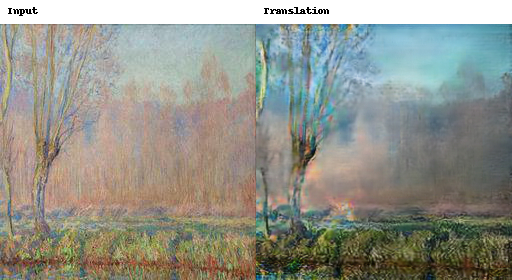
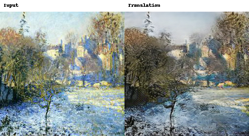
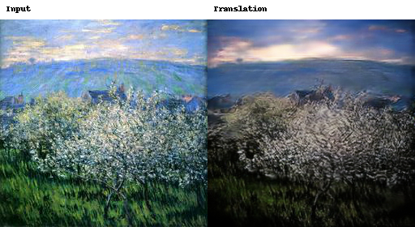
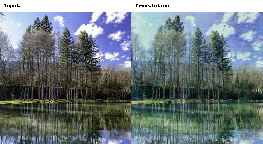
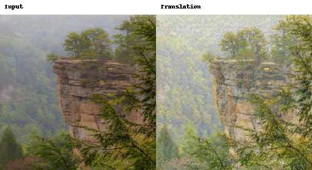
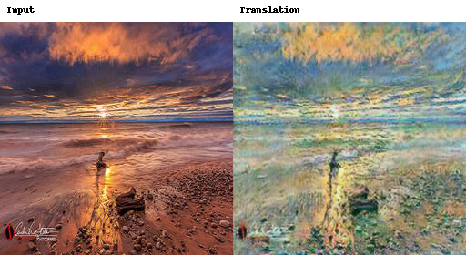

# Task 3 failure analysis — Viraat Chaudhary

## Selection and scope

These six cases are the three highest cycle-LPIPS cases per direction among the
30 preselected audit panels. They are not claimed to be the worst of all 600
translations. Selection used the saved per-sample cycle CSV; the visual observations
below inspect the unchanged input/translation panels. Those panels do not display
cycle reconstructions: the reconstruction numbers come from the metric CSV.
No new inference, image editing or simulated human rating was used.

The examples expose incomplete photo-domain conversion, contrast/color changes
and fine-detail loss. Proposed fixes below are future experiments, not changes
already tested or an assertion of causal diagnosis.

## AUDIT_004 — Incomplete photographic texture and loss of fine branches

Direction: **A2B**. Source: `586acab7c5.jpg`.
Cycle L1 [0,1]: **0.034307**;
cycle AlexNet LPIPS: **0.540362**.

The translated woodland changes the color balance and increases contrast, but the background remains smeared and painterly. Thin branches become less distinct and the foreground is reorganized into heavier dark texture. The scene is recognizable without being consistently photographic.

**Testable next experiment:** In a future controlled run, compare six and nine residual blocks while holding the remaining schedule and losses fixed. Test whether added capacity improves A2B KID and fine-detail preservation without increasing cycle error.

## AUDIT_001 — Darkening and residual brush-like texture

Direction: **A2B**. Source: `118da0690c.jpg`.
Cycle L1 [0,1]: **0.052304**;
cycle AlexNet LPIPS: **0.519985**.

The snowy scene becomes grayer and darker. The building and broad tree layout survive, but the translation retains visibly rough texture and merges foreground branches into larger dark regions. This is partial domain conversion rather than a convincing photograph.

**Testable next experiment:** Compare identity ratio 0.25 with 0.5 while keeping the architecture fixed. Measure exposure/color drift, content cosine and A2B FID/KID to test whether greater identity pressure preserves source colors at the expense of translation strength.

## AUDIT_012 — Exposure change and exaggerated repetitive texture

Direction: **A2B**. Source: `f0884db067.jpg`.
Cycle L1 [0,1]: **0.055689**;
cycle AlexNet LPIPS: **0.483064**.

The flowering vegetation becomes darker and has dense repeated bright strokes. The sky changes to a much darker gradient, and fine flower/leaf detail is replaced by coarse texture. The broad horizon remains, but local realism and lighting consistency are weak.

**Testable next experiment:** Use a fixed validation panel set to compare intermediate saved checkpoints under the same automatic protocol, without hand-picking submission images. Test whether the effect emerges late in training; compare identical losses and seeds before changing the objective.

## AUDIT_002 — Tree-detail softening and color changes

Direction: **B2A**. Source: `1d640e96a3.jpg`.
Cycle L1 [0,1]: **0.057657**;
cycle AlexNet LPIPS: **0.463376**.

The lake/tree scene moves toward a pale textured painting while retaining the skyline and reflection layout. Thin trunks and cloud boundaries become softer; some tree regions acquire strong blue-green color. This demonstrates a style/content tradeoff rather than complete scene loss.

**Testable next experiment:** Test cycle weight 10 against a stronger fixed weight such as 12.5, with other choices unchanged. Compare direct content cosine and both cycle metrics alongside FID/KID, rather than accepting reconstruction improvement alone.

## AUDIT_015 — Cliff-texture washing and contrast loss

Direction: **B2A**. Source: `20f93c26b0.jpg`.
Cycle L1 [0,1]: **0.071630**;
cycle AlexNet LPIPS: **0.401893**.

The cliff outline remains recognizable, but rock strata and distant terrain are washed into pale mottled texture. Fine rock boundaries and depth cues are weaker. The observed texture change may aid the painting domain while reducing specific scene detail.

**Testable next experiment:** Compare six versus nine residual blocks or a modest identity-weight increase in separate controlled experiments. Check edge/detail preservation with the same examples, content cosine and KID; the present multi-change run cannot identify a single cause.

## AUDIT_023 — Loss of sunset contrast and disruption of small objects

Direction: **B2A**. Source: `1b4f115bdd.jpg`.
Cycle L1 [0,1]: **0.064907**;
cycle AlexNet LPIPS: **0.394317**.

The horizon and approximate shoreline survive, but the orange/black sunset becomes a bright blue-green textured scene. The small foreground figures/objects become less distinct and the sun/reflection contrast is substantially changed. Content preservation is incomplete even though the broad scene remains.

**Testable next experiment:** Test identity ratio 0.25 versus 0.5 to investigate excessive color/contrast change. Evaluate the fixed panel and the complete evaluation set; do not manually repair or replace submission images.

## Constraints on interpretation

Cycle metrics measure round-trip reconstruction, not direct translation correctness.
The source and target domains are unpaired and provide no ground-truth translated
counterpart. A small cycle L1 does not establish good photographic or Monet style,
and a poor cycle LPIPS does not alone locate the visual error in the direct output.
All examples are from the supplied training-domain evaluation protocol.

Any follow-up comparison should retain the full fixed inference set and an unchanged
class evaluator. No manual edits, external image generator or selective replacement
of submission images should be used. The present completed run remains the
reported run; the proposed tests are optional future work.
